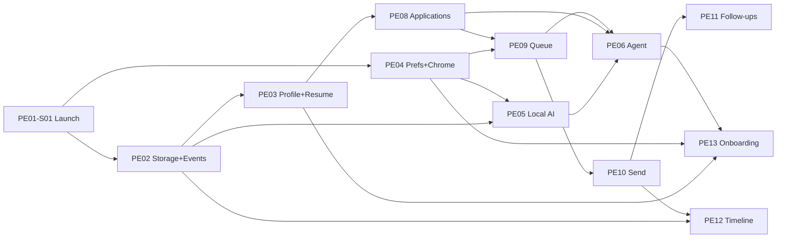

# Implementation Roadmap

> **Build order for platform stories (`PE*`)** — GitHub Roadmap / Projects–ready.
> Not product vision. Not architecture design.
>
> **Stories SSOT:** [docs/roadmap/USER_STORIES.md](docs/roadmap/USER_STORIES.md) (reviewed: [STORIES_REVIEW.md](docs/roadmap/STORIES_REVIEW.md))  
> **Delivery SSOT:** [docs/backlog/](docs/backlog/) (`E*` + [DEPENDENCY_GRAPH.md](docs/backlog/DEPENDENCY_GRAPH.md))  
> **Board columns:** [docs/backlog/PROJECT_BOARD.md](docs/backlog/PROJECT_BOARD.md)  
> **GitHub import:** [docs/backlog/GITHUB_PROJECT_IMPORT.md](docs/backlog/GITHUB_PROJECT_IMPORT.md) · [docs/backlog/import/github-issues.csv](docs/backlog/import/github-issues.csv)  
> **Canonical task order:** [IMPLEMENTATION_ORDER.md](IMPLEMENTATION_ORDER.md)

**Feature status gates commitment:** [FEATURES.md](docs/product/FEATURES.md) — Core · H1 before Experimental; Future stays parked.

---

## How to use this file

1. For **day-to-day coding order**, follow [IMPLEMENTATION_ORDER.md](IMPLEMENTATION_ORDER.md) (canonical).
2. Implement **one vertical slice** at a time ([VERTICAL_SLICES.md](docs/backlog/VERTICAL_SLICES.md)).
3. Map `PE*` → `E*` via the coverage table in USER_STORIES when filing GitHub issues.
4. Do **not** pull Experimental/Future into Wave 0–7 without explicit admission.

---

## Ordering principles

1. Shell + IPC before domain features  
2. Storage + events before identity / prefs / AI  
3. Honest **Agent · On-device** chrome early (before model config)  
4. Identity + Preferences before Agent prep  
5. Applications + Queue before Send  
6. Send before follow-ups that egress  
7. Agent never depends on Send execute (fence only)  
8. One vertical slice; no UI → AI Provider; no JobJitsu cloud milestones  

---

## Critical path (Core · H1)

Discovery (`PE07`) is **parallel** after events + fit prefs; not on the sole critical path to Send (drafts can use fixture roles).

---

## Wave index

| Wave | Name | Status band | Exit criteria |
|------|------|-------------|----------------|
| **0** | Shell boots | Core · H1 | Window + IPC deny + nav + dark default + Agent chrome region |
| **1** | Data & event spine | Core · H1 | Persist + typed bus + durable hook |
| **2** | Trust & identity | Core · H1 | Profile/resume import; approval default on; fit prefs; empty states |
| **3** | Local intelligence | Core · H1 | Fake/local provider; Context Builder; offline-primary; model path |
| **4** | Craft objects | Core · H1 | CSV/fixture roles; app drafts list/detail; optional tailor/cover drafts |
| **5** | Sovereignty path | Core · H1 | Queue → Send stub → Timeline egress audit; agent↛send fence |
| **6** | Agent & nudges | Core · H1 | Pause/prep enqueue; follow-ups persist/dismiss under policy |
| **7** | First-run polish | Core · H1 | Calm onboarding; H1 must-pass green |
| **8** | Experimental (parked) | Experimental | Admit per FEATURES; not Ready by default |
| **9** | Future (parked) | Future | Stubs only until admission |

Aligns with backlog waves 0–6 ≈ PE waves 0–7; backlog 7–9 ≈ PE 8–9.

---

## Wave 0 — Shell boots

**Goal:** Desktop host is runnable with calm chrome and closed IPC.  
**Backlog:** E01, E03 · **Sprint:** [sprint-1.md](docs/backlog/sprint-1.md)

| Order | Story | Priority | Depends | Notes |
|------:|-------|----------|---------|-------|
| 1 | [PE01-S01](docs/roadmap/USER_STORIES.md#pe01-s01--launch-desktop-host) Launch desktop host | P0 | — | Start here |
| 2 | [PE01-S03](docs/roadmap/USER_STORIES.md#pe01-s03--deny-by-default-ipc) Deny-by-default IPC | P0 | PE01-S01 | Parallel with nav |
| 3 | [PE01-S02](docs/roadmap/USER_STORIES.md#pe01-s02--navigate-primary-h1-sections) Navigate primary H1 sections | P0 | PE01-S01 | Applications, Queue, Follow-ups, Agent, Preferences, Timeline |
| 4 | [PE01-S04](docs/roadmap/USER_STORIES.md#pe01-s04--dark-default-appearance) Dark-default appearance | P1 | PE01-S01 | Parallel |
| 5 | [PE04-S03](docs/roadmap/USER_STORIES.md#pe04-s03--show-agent--on-device-status) Show Agent · On-device status | P0 | PE01-S01 | Chrome before model path |

**Exit:** Launch smoke green; unknown IPC fails closed; status region never says “Local LLM.”

---

## Wave 1 — Data & event spine

**Goal:** On-device persistence and in-process events.  
**Backlog:** E02

| Order | Story | Priority | Depends |
|------:|-------|----------|---------|
| 1 | [PE02-S01](docs/roadmap/USER_STORIES.md#pe02-s01--persist-documents-on-device) Persist documents on-device | P0 | PE01-S01 |
| 2 | [PE02-S02](docs/roadmap/USER_STORIES.md#pe02-s02--typed-local-event-bus) Typed local event bus | P0 | PE01-S01 |
| 3 | [PE02-S03](docs/roadmap/USER_STORIES.md#pe02-s03--durable-event-hook) Durable event hook | P1 | PE02-S02 |

**Exit:** Restart keeps data; bus has no network I/O; durable sink callable (no-op OK until Timeline).

**Parallel:** PE02-S01 ‖ PE02-S02 after Wave 0.

---

## Wave 2 — Trust & identity

**Goal:** Local profile/resume and sovereignty defaults.  
**Backlog:** E04, E05

| Order | Story | Priority | Depends |
|------:|-------|----------|---------|
| 1 | [PE03-S01](docs/roadmap/USER_STORIES.md#pe03-s01--maintain-local-profile) Maintain local profile | P0 | PE02-S01 |
| 2 | [PE04-S01](docs/roadmap/USER_STORIES.md#pe04-s01--set-approval-before-send-default-on) Approval-before-send default on | P0 | PE02-S01 |
| 3 | [PE03-S02](docs/roadmap/USER_STORIES.md#pe03-s02--import-resume-into-resume-library) Import resume | P0 | PE03-S01 |
| 4 | [PE04-S04](docs/roadmap/USER_STORIES.md#pe04-s04--fit-tone-and-constraint-preferences) Fit / tone / constraints | P0 | PE04-S01 |
| 5 | [PE04-S02](docs/roadmap/USER_STORIES.md#pe04-s02--quiet-hours-and-calm-notifications) Quiet hours fields | P1 | PE04-S01 |
| 6 | [PE03-S03](docs/roadmap/USER_STORIES.md#pe03-s03--version-and-select-resumes) Version and select resumes | P1 | PE03-S02 |
| 7 | [PE13-S02](docs/roadmap/USER_STORIES.md#pe13-s02--calm-empty-states-for-primary-lists) Calm empty states | P1 | PE01-S02 |

**Exit:** Import works; approval default on; fit prefs persist; empty lists are calm.

**Parallel:** PE03-* ‖ PE04-* after Wave 1.

---

## Wave 3 — Local intelligence

**Goal:** Local AI Provider + Context Builder; offline-primary.  
**Backlog:** E06  
**Out of wave:** PE05-S04 (Experimental → Wave 8)

| Order | Story | Priority | Depends |
|------:|-------|----------|---------|
| 1 | [PE05-S01](docs/roadmap/USER_STORIES.md#pe05-s01--ai-provider-health-and-complete) AI Provider health/complete | P0 | PE02-S02 |
| 2 | [PE05-S03](docs/roadmap/USER_STORIES.md#pe05-s03--context-builder-minimizes-prompt-context) Context Builder | P0 | PE05-S01, PE03-S01 |
| 3 | [PE05-S05](docs/roadmap/USER_STORIES.md#pe05-s05--offline--local-primary-path) Offline / local-primary | P0 | PE05-S01 |
| 4 | [PE05-S02](docs/roadmap/USER_STORIES.md#pe05-s02--configure-local-model-path) Configure local model path | P0 | PE05-S01, PE04-S01 |

**Exit:** Fake provider contract tests green; no silent cloud fallback; KnowledgeReader may be no-op.

---

## Wave 4 — Craft objects

**Goal:** Roles + application drafts (Send still locked).  
**Backlog:** E07, E08

| Order | Story | Priority | Depends | Track |
|------:|-------|----------|---------|-------|
| 1 | [PE08-S01](docs/roadmap/USER_STORIES.md#pe08-s01--create-and-edit-application-drafts) Create/edit application drafts | P0 | PE03-S02 | Apps (critical) |
| 2 | [PE08-S04](docs/roadmap/USER_STORIES.md#pe08-s04--list-and-open-applications) List and open applications | P0 | PE08-S01 | Apps |
| 3 | [PE07-S01](docs/roadmap/USER_STORIES.md#pe07-s01--register-a-job-provider-source) Register Job Provider (CSV/fixture) | P0 | PE02-S02 | Discovery ‖ |
| 4 | [PE07-S02](docs/roadmap/USER_STORIES.md#pe07-s02--curate-roles-toward-fit) Curate roles toward fit | P1 | PE07-S01, PE04-S04 | Discovery ‖ |
| 5 | [PE07-S04](docs/roadmap/USER_STORIES.md#pe07-s04--browse-and-select-curated-roles) Browse/select roles | P1 | PE07-S02 | Discovery ‖ |
| 6 | [PE08-S02](docs/roadmap/USER_STORIES.md#pe08-s02--generate-cover-letter-draft) Cover letter draft | P1 | PE08-S01, PE05-S01 | Craft |
| 7 | [PE03-S04](docs/roadmap/USER_STORIES.md#pe03-s04--tailor-resume-draft-no-send) Tailor resume draft (no send) | P0 | PE03-S02, PE05-S01, PE05-S03 | Craft |
| 8 | [PE07-S03](docs/roadmap/USER_STORIES.md#pe07-s03--analyze-job-vs-profile-local) Analyze job vs profile | P1 | PE07-S01, PE05-S03 | Craft |

**Exit:** Applications list/detail; fixture/CSV roles optional; drafts never auto-send.

---

## Wave 5 — Sovereignty path

**Goal:** Review → approve → egress audited.  
**Backlog:** E09, E10, E13

| Order | Story | Priority | Depends |
|------:|-------|----------|---------|
| 1 | [PE09-S01](docs/roadmap/USER_STORIES.md#pe09-s01--enqueue-application-for-review) Enqueue for review | P0 | PE08-S01 |
| 2 | [PE09-S02](docs/roadmap/USER_STORIES.md#pe09-s02--approve-or-reject-queue-items) Approve or reject | P0 | PE09-S01, PE04-S01 |
| 3 | [PE12-S01](docs/roadmap/USER_STORIES.md#pe12-s01--inspect-local-timeline) Inspect local timeline | P0 | PE02-S03 |
| 4 | [PE10-S01](docs/roadmap/USER_STORIES.md#pe10-s01--send-only-through-send-package-first-channel-stub) Send via send package (stub channel) | P0 | PE09-S02 |
| 5 | [PE10-S02](docs/roadmap/USER_STORIES.md#pe10-s02--audit-egress-on-timeline) Audit egress on Timeline | P0 | PE10-S01, PE12-S01 |
| 6 | [PE08-S03](docs/roadmap/USER_STORIES.md#pe08-s03--track-application-status-post-send) Track status post-send | P1 | PE08-S01, PE10-S01 |
| 7 | [PE12-S02](docs/roadmap/USER_STORIES.md#pe12-s02--sanitized-logs-view) Sanitized logs view | P1 | PE12-S01 |

**Exit:** `canSend` / approval enforced; file or mailto stub; egress on Timeline; agent↛send fence green.

**Note:** PE12-S01 may start as soon as PE02-S03 lands (parallel track).

---

## Wave 6 — Agent & nudges

**Goal:** Preparative Agent + polite follow-ups.  
**Backlog:** E12, E11

| Order | Story | Priority | Depends |
|------:|-------|----------|---------|
| 1 | [PE06-S01](docs/roadmap/USER_STORIES.md#pe06-s01--start-and-pause-agent-work) Start and pause agent | P0 | PE04-S01, PE05-S01 |
| 2 | [PE06-S02](docs/roadmap/USER_STORIES.md#pe06-s02--orchestrate-drafts-into-review-queue) Orchestrate into Queue | P0 | PE06-S01, PE08-S01, PE09-S01 |
| 3 | [PE11-S01](docs/roadmap/USER_STORIES.md#pe11-s01--schedule-a-polite-follow-up) Schedule follow-up | P1 | PE08-S03, PE02-S01 |
| 4 | [PE11-S03](docs/roadmap/USER_STORIES.md#pe11-s03--scheduler-survives-restart) Scheduler survives restart | P1 | PE11-S01 |
| 5 | [PE11-S02](docs/roadmap/USER_STORIES.md#pe11-s02--receive-calm-due-notification) Calm due notification | P1 | PE11-S01, PE04-S02 |
| 6 | [PE11-S04](docs/roadmap/USER_STORIES.md#pe11-s04--dismiss-or-send-follow-up-under-policy) Dismiss or send under policy | P1 | PE11-S02, PE09-S02, PE10-S01 |

**Exit:** Pause leaves Queue intact; prep never Send.Attempted; follow-up send uses policy path.

**Hard constraint:** Agent must **not** gain a runtime dependency on Send execute — fence tests only.

---

## Wave 7 — First-run polish

**Goal:** Ship-quality H1 companion.  
**Backlog:** E14 + QA must-pass

| Order | Story | Priority | Depends |
|------:|-------|----------|---------|
| 1 | [PE13-S01](docs/roadmap/USER_STORIES.md#pe13-s01--complete-calm-first-run-onboarding) Calm first-run onboarding | P1 | PE04-S01, PE03-S02, PE04-S03 |

**Exit:** Three-beat (or equivalent) onboarding without forced model wall; privacy must-pass tests green.

---

## Wave 8 — Experimental (parked)

> Not on the Ready board until FEATURES admits them and a backlog epic exists.

| Order | Story | Depends | When |
|------:|-------|---------|------|
| — | PE05-S04 Optional remote AI Provider | PE05-S01 | After Core chrome honesty |
| — | PE14-S01 / PE14-S02 Knowledge Base | PE02-S01 / PE05-S03 | After Context Builder |
| — | PE15-S01 AI Validation | PE03-S04, PE05-S01 | After tailor drafts |
| — | PE16-S01 / S02 / S03 Workflow + AI Task Queue | PE06, PE08, PE09 | After Agent→Queue path |
| — | PE17-S01 Browser Automation assist | PE08-S01, PE04-S01 | After drafts |
| — | PE18-S01 Trusted Automation | PE10-S01, PE04-S01 | After Send |
| — | PE19-S01 AI Playground | PE05-S01 | Anytime after local AI |
| — | PE20-S01 Email integration | PE10-S01, PE04-S01 | After Send |

**Suggested Experimental order after Wave 7:** PE14 → PE15 → PE16 → PE19 → PE17 → PE18 → PE20 → PE05-S04.

---

## Wave 9 — Future (parked)

| Story | Theme |
|-------|--------|
| PE21-S01 | Outcomes & reflection |
| PE22-S01 | Interview readiness |
| PE23-S01 | Narrative studio |
| PE24-S01 | Recruiter & network nudges |
| PE25-S01 | Plugins (Agent Skills) |
| PE26-S01 / PE26-S02 | Export + Host Extensions |
| PE27-S01 | Multi-profile |
| PE28-S01 | Role-fit compass |
| PE29-S01 | Offer & decision journal |
| PE30-S01 | Skills & learning map |

No GitHub **Ready** column. Use view filter `Feature Status = Future`.

---

## PE ↔ backlog wave map

| PE wave | Backlog wave | Primary `E*` |
|---------|--------------|--------------|
| 0 | 0–1 | E01, E03 |
| 1 | 1 | E02 |
| 2 | 2 | E04, E05 |
| 3 | 3 | E06 |
| 4 | 3 | E07, E08 |
| 5 | 4 | E09, E10, E13 |
| 6 | 5 | E12, E11 |
| 7 | 6 | E14 |
| 8 | — | Admit new epics |
| 9 | 7–9 | E15–E19 + Future stubs |

---

## GitHub Roadmap / Projects mapping

Use [PROJECT_BOARD.md](docs/backlog/PROJECT_BOARD.md) for columns and fields.

| GitHub field | Value source |
|--------------|--------------|
| Title | `PE##-S## — {title}` |
| Epic | PE01–PE30 |
| Wave | 0–9 (number) |
| Feature Status | Core · H1 / Experimental / Future |
| Priority | P0 / P1 / P2 / P3 |
| Blocked by | Dependency story IDs |
| Horizon | H1 for Waves 0–7; H2+ for parked |

**Roadmap view:** group by **Wave**; sort by **Order** within wave.  
**Milestone suggestion (optional):** `W0 Shell` … `W7 Polish`; park Experimental/Future without milestones until admitted.

---

## Next slice recommendation

| Field | Value |
|-------|--------|
| **Next** | **PE01-S01 — Launch desktop host** |
| Why | Root of all waves; matches Sprint 1 foundation |
| Backlog twin | E01 / sprint-1 Desktop Foundation |
| After Done | PE01-S03 ‖ PE01-S02 ‖ PE01-S04 ‖ PE04-S03 |

When Sprint 1 items are already in progress, take the first **incomplete** row in Wave 0, then Wave 1, without skipping sovereignty fences.

---

## Related indexes

| Doc | Role |
|-----|------|
| [docs/backlog/README.md](docs/backlog/README.md) | Execution backlog index |
| [docs/backlog/DEPENDENCY_GRAPH.md](docs/backlog/DEPENDENCY_GRAPH.md) | `E*` build waves |
| [docs/backlog/PROJECT_BOARD.md](docs/backlog/PROJECT_BOARD.md) | GitHub Project columns/views |
| [docs/product/ROADMAP.md](docs/product/ROADMAP.md) | Directional horizons |
| [docs/roadmap/USER_STORIES.md](docs/roadmap/USER_STORIES.md) | Full PE* stories + AC |
| [DEFINITION_OF_DONE.md](DEFINITION_OF_DONE.md) | Completion gates |
| [docs/prompts/](docs/prompts/README.md) | Doc pipeline |

## Hard constraints (never invert)

1. Send (PE10) before any “auto apply” idea — and still never auto-apply by default.  
2. Queue policy (PE09) before Send execute when approval default is on.  
3. Fake/local provider before betting the UI on a real runner.  
4. Agent (PE06) must not depend on Send execute — fence only.  
5. No Future modules in Waves 0–7 without explicit user request.
