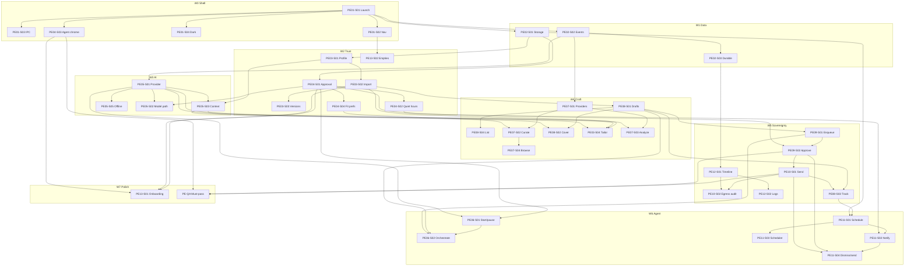

# Project Backlog Summary — JobJitsu

> **Phase 3 — Backlog planning / validation** · Generated 2026-07-23  
> Status: **AWAITING APPROVAL** — Phase 4 (GitHub sync) **not** started.  
> SSOT: `docs/product/*`, `docs/roadmap/USER_STORIES.md`, `docs/backlog/*`, `IMPLEMENTATION_ROADMAP.md`  
> Related: [REPOSITORY_INSPECTION_REPORT.md](./REPOSITORY_INSPECTION_REPORT.md) · [PROJECT_GAP_ANALYSIS.md](./PROJECT_GAP_ANALYSIS.md)

**This document describes the approved planning target.** Live GitHub already holds Core · H1 epics/stories (#1–#55). Sync after approval means **update + fill gaps**, not a greenfield recreate.

---

## Totals (documentation target)

| Level | Core · H1 | Experimental (parked) | Future (parked) | Notes |
|-------|----------:|----------------------:|----------------:|-------|
| **Milestones** | 8 (W0–W7) | 1 (W8) | 1 (W9) | **10** total |
| **Epics** | **13** (PE01–PE13) | 7 (PE14–PE20) | 10 (PE21–PE30) | Only Core filed on GitHub today |
| **User stories** | **41** + **PE-QA** | 11 (incl. PE05-S04) | **11** | Tasks = checklists inside stories |
| **Task issues** | **0** | 0 | 0 | Never file per-task issues |

**Live GitHub now:** 10 milestones · 13 epics · 42 stories · 55 project items.

---

## Story count per milestone (Core · H1 + PE-QA)

| Milestone | Stories | Epics also on milestone |
|-----------|--------:|-------------------------|
| W0 — Shell boots | 5 | PE01 (+ PE04-S03) |
| W1 — Data & event spine | 3 | PE02 |
| W2 — Trust & identity | 7 | PE03, PE04, PE13-S02 |
| W3 — Local intelligence | 4 | PE05 |
| W4 — Craft objects | 8 | PE07, PE08 (+ PE03-S04) |
| W5 — Sovereignty path | 7 | PE09, PE10, PE12 (+ PE08-S03) |
| W6 — Agent & nudges | 6 | PE06, PE11 |
| W7 — First-run polish | 2 | PE13-S01 + PE-QA |
| W8 — Experimental (parked) | 0 filed | stubs only if admitted |
| W9 — Future (parked) | 0 filed | stubs only if admitted |

*(Milestone open_issue counts on GitHub include epic issues, so they are higher than story-only counts.)*

---

## Story count per epic (Core)

| Epic | Name | Stories |
|------|------|--------:|
| PE01 | Desktop Shell & Foundation | 4 |
| PE02 | Storage & Event Spine | 3 |
| PE03 | Identity & Resume Library | 4 |
| PE04 | Preferences & Privacy Chrome | 4 |
| PE05 | Local Intelligence | 4 Core (`PE05-S04` Exp parked) |
| PE06 | Agent (preparative) | 2 |
| PE07 | Discovery & Job Providers | 4 |
| PE08 | Applications & Pipeline | 4 |
| PE09 | Queue & Human Review | 2 |
| PE10 | Send (Egress Boundary) | 2 |
| PE11 | Follow-ups & Scheduler | 4 |
| PE12 | Timeline & Trust | 2 |
| PE13 | Onboarding & Empty States | 2 |
| — | PE-QA (cross-cutting) | 1 |

---

## Required story body (Phase 4 update target)

Every **user story** issue must contain (from this PM brief; content sourced only from docs):

1. Summary  
2. User Story — As a… / I want… / So that…  
3. Description  
4. Acceptance Criteria  
5. Technical Notes  
6. Dependencies  
7. Testing Requirements — Unit / Integration / E2E  
8. Documentation Updates  
9. Definition of Done  
10. Implementation Checklist — Planning → Review  

Plus technical tasks as Markdown checkboxes (existing `PE##-S##-T##` lines).

**Metadata (already mostly set):** Milestone · Epic · Area · Priority · Complexity · Status · Labels · Wave · Feature Status · Horizon · AI Required · Package(s) *(to fill)* · Blocked by.

---

## Dependency graph (Core story spine)

Stories should depend on other stories only when required. Condensed from `GITHUB_PROJECT_IMPORT` / roadmap:

**Parallelism:** Within a wave, stories may proceed in parallel when their Depends are Done (e.g. PE01-S02 ‖ PE01-S03 after PE01-S01).

---

## Implementation order (Core only)

Aligned to docs waves — **not** inventing Experimental into Core:

1. **Foundation / Desktop UI** — PE01-S01 → S03 ‖ S02 ‖ S04 ‖ PE04-S03  
2. **Storage & Event System** — PE02-S01 ‖ PE02-S02 → PE02-S03  
3. **Configuration / Privacy** — PE04-S01 → S04 ‖ S02; PE03 identity track  
4. **AI Runtime / Model path** — PE05-S01 → S03 ‖ S05 ‖ S02  
5. **Resume / Discovery / Applications** — PE03-S04, PE07-*, PE08-* (W4)  
6. **Queue → Send → Timeline** — PE09 → PE10 → PE12 (+ PE08-S03)  
7. **Agent & Follow-ups** — PE06, PE11  
8. **Onboarding & H1 QA** — PE13-S01, PE-QA  

**Explicitly after admission (not in Core order):** Knowledge Base (PE14), Workflow Engine (PE16), Browser (PE17), Email (PE20), Plugins (PE25), Export (PE26), …

Canonical day-task sequence remains [IMPLEMENTATION_ORDER.md](./IMPLEMENTATION_ORDER.md).

---

## Validation checklist

| Check | Result |
|-------|--------|
| ✓ Every FEATURES **Core** module has ≥1 story | Pass |
| ✓ No undocumented Core features added | Pass |
| ✓ No duplicate Core story IDs on GitHub | Pass |
| ✓ Tasks not filed as separate issues | Pass |
| ✓ Stories sized for vertical slices / ~1 PR | Pass (multi-day stories keep day tasks as checklists) |
| ✓ Experimental/Future not auto-Ready | Pass (unfiled / W8–W9 empty) |
| ○ Story bodies match full PM template | **Fail** — update in Phase 4 |
| ○ Package(s) populated | **Fail** — update in Phase 4 |
| ○ `.github/ISSUE_TEMPLATE` present | **Fail** — add in Phase 4 |
| ○ Native blocked-by / parent links | Partial |

---

## Missing documentation (hygiene only — no scope expansion)

- FEATURES Experimental rows still say “backlog epic pending” while PE14–PE16 exist in roadmap.  
- No in-repo issue template yet.  
- Model Manager PLATFORM_SPEC depth vs PE05-S02 AC is thinner by design (path + lazy load for H1).  
- Dual PE*/E* IDs require the coverage map in `docs/roadmap/USER_STORIES.md`.

---

## Phase 4 preview (blocked until approval)

If approved, sync will:

1. **Create** missing labels (`status:experimental`, `status:future`).  
2. **Add** `.github/ISSUE_TEMPLATE` matching the required story body.  
3. **Update** existing story issues #14–#55 (and optionally epics) to the full body template using docs text only.  
4. **Populate** Package(s) from architecture package boundaries.  
5. **Optionally** wire parent/sub-issue + native blocked-by.  
6. **Not** recreate #1–#55.  
7. **Not** file PE14–PE30 unless you explicitly approve parked stubs.

Then refresh this file with post-sync counts, skipped items, conflicts, and final order.

---

## WAITING FOR APPROVAL

Please reply with one of:

1. **Approve Phase 4 as recommended** (update bodies + template + Package(s) + labels; no parked filing).  
2. **Approve Phase 4 + file parked Experimental/Future stubs** on W8/W9.  
3. **Request changes** (specify what to alter before sync).

No GitHub Issues will be created or modified until you approve.
