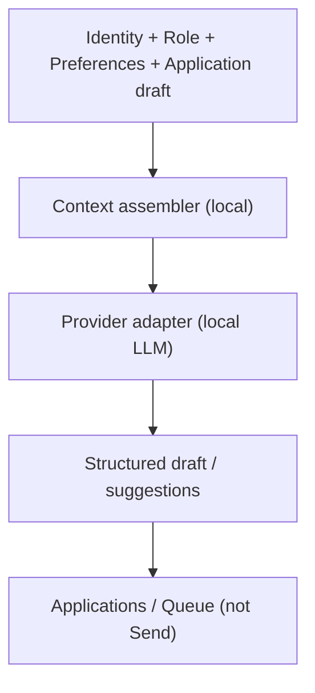

# AI Architecture

> Local Intelligence — on-device reasoning for craft, not cloud résumé farming.

Parent: [OVERVIEW.md](./OVERVIEW.md) · Package: `packages/ai` · Product: Local Intelligence module · Terms: [../product/TERMINOLOGY.md](../product/TERMINOLOGY.md)

---

## Thesis

AI in JobJitsu **helps draft, tailor, queue, and remind**. It does not guarantee interviews or own the send button. The primary path is a **user-provided local LLM** (and local embeddings when used). Status chrome (**Agent · On-device**) must reflect provider locality honestly.



---

## Components

| Component | Role |
|-----------|------|
| **Provider interface** | `health`, `complete`, `embed` (optional) — swappable runtimes |
| **Local adapters** | Bind to on-device runners (user model path / runtime) |
| **Remote adapters** | Optional, **explicit user config only**; UI must not look “Local” when remote |
| **Context assembler** | Builds minimal prompts from local stores |
| **Prompt roles** | Tailor, match explain, follow-up draft, parse assist |
| **Tool bridge** | Exposes safe tools to Agent / plugins via host |
| **Status publisher** | Emits `Ai.LocalModel*` for trust chrome |

---

## Provider contract (conceptual)

- `health()` → ready | loading | unavailable | misconfigured  
- `complete(request)` → text/structured result; runs where configured  
- `embed(texts)` → vectors for local search (stored on-device)

Providers must not phone home with résumé text unless the user selected a remote endpoint knowingly.

---

## Context & data minimization

Include only what the task needs:

| Task | Typical context |
|------|-----------------|
| Tailor cover letter | Résumé excerpts, role description, tone prefs |
| Fit note | Skills vs requirements (short) |
| Follow-up draft | Prior send metadata, polite tone prefs |

Avoid dumping entire timeline history into every prompt. No hidden training export.

---

## Agent ↔ AI relationship

- Agent plans steps; AI executes language/embedding tasks.
- Tools that mutate drafts go to Applications/Queue.
- Tools that would egress are **not** exposed to AI directly — only send intents through policy.

```
✅ GOOD: AI produces tailored draft → Queue.Enqueued
❌ BAD:  AI tool “submitApplication” with network socket
```

---

## Honest AI product rules (architecture-enforced)

1. Status chrome shows **Agent · On-device** only when the active provider is local (technical locality remains “Local LLM” in provider/config docs).
2. If user configures remote, chrome labels it plainly (e.g. “Remote model — user configured”).
3. Failures use plain recovery (`Ai.LocalModelFailed` → preferences path).
4. Outputs are suggestions; user remains author of final voice.
5. No UI copy claiming guaranteed offers from model output.

---

## Embeddings & local retrieval (optional)

- Indexes live under local storage.
- Used for discovery curation / résumé section retrieval.
- Rebuilt on-device; not uploaded.

---

## Performance & resource respect

- Lazy-load model weights until first need or user warm-up.
- Allow pause of AI work with Agent.Paused.
- Surface resource failures calmly (“Local LLM ran out of resources”).

---

## Security

- Model path is user-controlled; validate path permissions.
- Prompt injection from job descriptions treated as untrusted input — tools remain capability-gated.
- Logs redact prompt bodies by default in shared diagnostics.

---

## Out of scope

- Fine-tuning on user data in a JobJitsu cloud.
- Default vendor cloud LLM.
- Autopilot send from model confidence scores.
