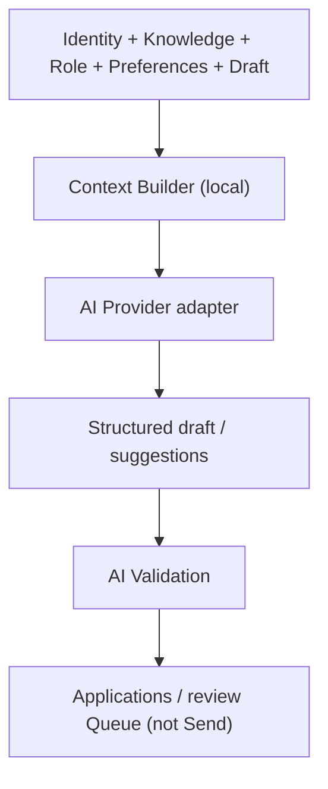

# AI Architecture

> Local Intelligence — on-device reasoning for craft, not cloud résumé farming.

Parent: [OVERVIEW.md](./OVERVIEW.md) · Package: `packages/ai` · [WORKFLOW_ENGINE.md](./WORKFLOW_ENGINE.md) · Terms: [../product/TERMINOLOGY.md](../product/TERMINOLOGY.md)

---

## Thesis

AI in JobJitsu **helps draft, tailor, queue, and remind**. It does not guarantee interviews or own the send button. The primary path is a **user-provided local LLM** (and local embeddings when used). Status chrome (**Agent · On-device**) must reflect provider locality honestly.



---

## Components

| Component | Role |
|-----------|------|
| **AI Provider** | `health`, `complete`, `embed` (optional) — swappable runtimes |
| **Model Manager** | Load / select / unload / monitor models for providers (lives in `packages/ai`) |
| **Local adapters** | Bind to on-device runners (user model path / runtime) |
| **Remote adapters** | Optional, **explicit user config only**; never labeled Agent · On-device |
| **Context Builder** | Assembles minimal prompts (alias: context assembler) |
| **AI Validation** | Post-generate gates — see [WORKFLOW_ENGINE.md](./WORKFLOW_ENGINE.md) |
| **Prompt roles** | Tailor, match explain, follow-up draft, parse assist |
| **Tool bridge** | Safe tools to Agent / Plugins via host |
| **Status publisher** | Emits `Ai.LocalModel*` / `Ai.Started` / `Ai.Finished` for chrome |

---

## Provider contract (conceptual)

- `health()` → ready | loading | unavailable | misconfigured  
- `complete(request)` → text/structured result; runs where configured  
- `embed(texts)` → vectors for local search (stored on-device)

Providers must not phone home with résumé text unless the user selected a remote endpoint knowingly.

---

## Context Builder

Canonical term: **Context Builder**. Default slice order for apply-craft: Profile → Resume → Projects → Achievements → Current Job → Prompt → Model (budgeted by task). Retrieves from Knowledge Base when available via a **`KnowledgeReader` port** (implemented by `identity`; `ai` must not own knowledge writes). See [DATA_MODELS.md](./DATA_MODELS.md) and [WORKFLOW_ENGINE.md](./WORKFLOW_ENGINE.md).

| Task | Typical context |
|------|-----------------|
| Tailor cover letter | Résumé excerpts, role description, tone prefs |
| Fit note | Skills vs requirements (short) |
| Follow-up draft | Prior send metadata, polite tone prefs |

Avoid dumping entire Timeline history into every prompt. No hidden training export.

---

## Agent ↔ AI relationship

- Agent **Workflow Engine** plans steps; AI executes language/embedding tasks inside Running Task Queue items.
- Tools that mutate drafts go to Applications / review Queue.
- Tools that would egress are **not** exposed to AI — only through policy → Queue → Send.

```
✅ GOOD: AI produces tailored draft → validation → Queue.Enqueued
❌ BAD:  AI tool “submitApplication” with network socket
```

---

## Honest AI product rules

1. Status chrome shows **Agent · On-device** only when the active provider is local.
2. Remote providers labeled plainly (e.g. “Remote model — user configured”).
3. Failures use plain recovery (`Ai.LocalModelFailed` → preferences path).
4. Outputs are suggestions; user remains author of final voice.
5. Resource failures: calm copy (“On-device model ran out of resources”).

---

## Embeddings & local retrieval (optional)

- Indexes under local storage; used for Knowledge / résumé section retrieval; not uploaded.

## Performance

- Lazy-load weights; honor `Agent.Paused`; unload after Task Queue drain / idle.

## Security

- User-controlled model path; JD treated as untrusted; logs redact prompt bodies by default.

## Out of scope

- Fine-tuning on user data in a JobJitsu cloud; default vendor cloud LLM; autopilot send from model confidence.
