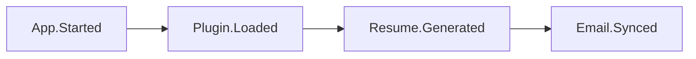
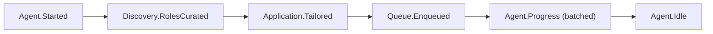
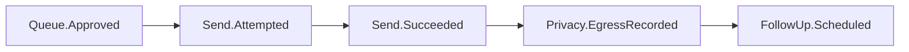
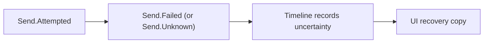

# Event System

> Local, typed, calm domain events — the nervous system of the Career OS.

Parent: [OVERVIEW.md](./OVERVIEW.md) · Packages: [PACKAGE_BOUNDARIES.md](./PACKAGE_BOUNDARIES.md)

---

## Purpose

Events let Agent, Queue, Send, Follow-ups, Timeline, Scheduler, and UI stay loosely coupled while preserving:

- **Inspectability** — progress is observable without a cockpit of polling.
- **Privacy audit** — egress-related events feed Timeline (“what left / what stayed”).
- **Calm UX** — UI subscribes and batches; no siren for every tick.

Events **never** stream career payloads to a JobJitsu cloud by default.

---

## Design laws

1. **On-device bus** — in-process (host) event bus; optional durable log in Timeline storage.
2. **Typed contracts** — event names and payloads live in `packages/events`.
3. **PII minimization** — payloads carry IDs and coarse metadata; avoid résumé bodies on high-volume events.
4. **Batching at the edge** — UI and notifications collapse bursts (“3 applications queued”).
5. **No urgency semantics** — event types do not encode streaks, guilt, or “you’re behind.”
6. **Egress events are special** — send attempted/succeeded/failed/unknown always recorded.
7. **UI never calls AI** — the renderer subscribes to facts; the host invokes providers inside event handlers.

### Startup cascade (demo)



Host runtime (`app/src/host`) owns this chain with fake providers. See Dojo activity view.

---

## Event catalog (core)

Naming: `Domain.Action` in past tense where possible (facts that happened).

### App / identity / mail (host lifecycle)
| Event | Meaning |
|-------|---------|
| `App.Started` | Desktop host finished boot wiring |
| `Plugin.Loaded` | Plugin module loaded into host (may still be disabled) |
| `Resume.Imported` | User imported a résumé (ID only) |
| `Resume.Generated` | On-device résumé prepared (ID only on bus) |
| `Job.Imported` | Single role ingested |
| `Jobs.Synced` | Job Provider sync batch finished (counts) |
| `Email.Synced` | Mailbox channel sync finished (counts only; fake or real) |

### Agent / Workflow
| Event | Meaning |
|-------|---------|
| `Agent.Started` | Run began under preferences |
| `Agent.Paused` | User or policy paused; review queue intact |
| `Agent.Resumed` | Run continued |
| `Agent.Progress` | Coarse progress (counts, stage) — batchable |
| `Agent.Idle` | Belt tied — waiting for signal |
| `Agent.Failed` | Preparative failure (not send) |
| `Workflow.Started` | Workflow run began |
| `Workflow.Completed` | Workflow run finished successfully |
| `Workflow.Failed` | Workflow run failed |

### Discovery
| Event | Meaning |
|-------|---------|
| `Discovery.RolesFound` | Candidates fetched (count + source id) |
| `Discovery.RolesCurated` | Filtered toward fit |

### Applications
| Event | Meaning |
|-------|---------|
| `Application.DraftCreated` | New draft |
| `Application.Tailored` | Local intelligence applied |
| `Application.Updated` | User or agent edited |
| `Application.StageChanged` | Tracking status changed (see [DATA_MODELS.md](./DATA_MODELS.md)) |
| `Application.Submitted` | Domain outcome after approved egress (also emit `Send.*`) |

### Knowledge
| Event | Meaning |
|-------|---------|
| `Knowledge.Updated` | Knowledge Base entry created/updated (ID + kind only) |

### Queue
| Event | Meaning |
|-------|---------|
| `Queue.Enqueued` | Awaiting review / approval |
| `Queue.Approved` | User approved send |
| `Queue.Rejected` | User declined / returned to draft |
| `Queue.Cleared` | Removed without send |

### Send (egress)
| Event | Meaning |
|-------|---------|
| `Send.Attempted` | Outbound started (destination class) |
| `Send.Succeeded` | Confirmed leave |
| `Send.Failed` | Did not complete; draft retained policy |
| `Send.Unknown` | Cannot confirm — must not treat as success |

### Follow-ups
| Event | Meaning |
|-------|---------|
| `FollowUp.Scheduled` | Reminder armed (“Follow-up Created”) |
| `FollowUp.Due` | Polite nudge ready (caution, not error) |
| `FollowUp.Sent` | Nudge egress via send channel |
| `FollowUp.Dismissed` | User deferred/cancelled |

### AI / Privacy
| Event | Meaning |
|-------|---------|
| `Ai.Started` | Inference / AI task unit began |
| `Ai.Finished` | AI task unit finished successfully |
| `Ai.ValidationCompleted` | Validation report summary (pass\|warn\|fail counts) |
| `Ai.LocalModelLoading` | Warm-up |
| `Ai.LocalModelReady` | Agent · On-device may show ready |
| `Ai.LocalModelFailed` | Preferences / path recovery |
| `Privacy.EgressRecorded` | Timeline audit written |

### Extensions / Plugins / Preferences / System
| Event | Meaning |
|-------|---------|
| `Preferences.Changed` | Policy inputs changed |
| `Scheduler.JobRan` | Local job executed |
| `Plugin.Enabled` / `Plugin.Disabled` | User toggled agent skill |
| `Extension.Registered` | Extension contribution registered |
| `Extension.Enabled` / `Extension.Disabled` | User toggled extension |
| `Extension.Unloaded` | Extension removed from host |
| `Extension.Failed` | Extension load/run failure |

**SSOT:** `packages/events` must match this catalog when coded. Illustrative chains in [ARCHITECTURE_PRINCIPLES.md](../../ARCHITECTURE_PRINCIPLES.md) use these names only.

---

## Payload guidelines

```
✅ GOOD: { applicationId, stage, count }
❌ BAD:  { fullResumeText, coverLetterBody } on Agent.Progress
```

Full documents stay in storage; events reference them. Egress events may note **destination class** (board | mail | file export) without logging secrets.

---

## Flow examples

### Preparative path (no egress)



### Sovereign send



### Honest failure



---

## Consumers

| Consumer | Interest |
|----------|----------|
| Timeline | Persist audit & craft history |
| Desktop UI | Status, toasts (batched), badge |
| Scheduler | Arm/cancel jobs from domain facts |
| Notifications | FollowUp.Due, approval needed — calm |
| Plugins | Only events allowed by capability |

---

## Durability

- **Ephemeral bus:** UI live updates.
- **Durable allowlist (normative):** `Send.Attempted|Succeeded|Failed|Unknown`, `Privacy.EgressRecorded`, `Queue.Approved|Rejected`, `Agent.Paused`, `Preferences.Changed`, `Plugin.Enabled|Disabled`, `Extension.Enabled|Disabled`, `Application.Submitted`.
- Optional durable: `FollowUp.Sent`, `Workflow.Failed`, `Ai.ValidationCompleted` (fail) — product may expand without removing the allowlist.
- Retention is user-local; export is an explicit Future module (portability), not ambient sync.

## Sovereignty acceptance criteria

| Flow | AC |
|------|----|
| Approval on | No `Send.Attempted` without `Queue.Approved` (unless Trusted Automation Experimental enabled) |
| Pause | `Agent.Paused` leaves review Queue intact; AI Task Queue cancels/freezes Running |
| Unknown send | `Send.Unknown` never shown as success |
| Validation fail | No `Queue.Enqueued` for send from failed validation |
| Trusted Automation | Default **off**; Timeline still records egress |

---

## Anti-patterns

- Remote event gateways for résumé-related streams.
- Per-keystroke agent events flooding the UI.
- Using events to drive guilt notifications (“no Apply in 5 days”).
- Plugins subscribing to all events without capability review.
