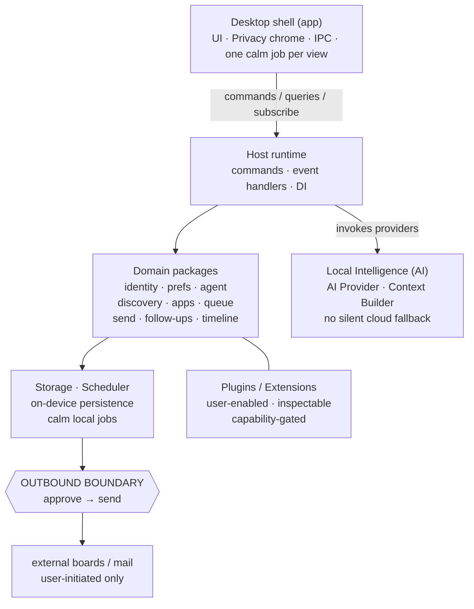

# JobJitsu Architecture

> Software architecture for the **AI Career Operating System**.  
> On-device. On-target. On your terms.

This folder defines **how the system is structured**. It is design intent — not runnable code, APIs, or a sprint backlog.

**Anchors:** [Product vision](../product/PRODUCT_VISION.md) · [Features](../product/FEATURES.md) · [Principles](../product/PRINCIPLES.md) · [Non-goals](../product/NON_GOALS.md) · [Terminology](../product/TERMINOLOGY.md) · [Architecture rule](../../.cursor/rules/architecture.mdc)

---

## Architecture thesis

JobJitsu is a **local-first desktop OS for career craft**. All intimate state lives on the machine. The agent prepares; **Send** is the only place career data may leave — and only with explicit user sovereignty. Automation is a belt, not a leash.

Status chrome for on-device intelligence is **Agent · On-device** (see [TERMINOLOGY.md](../product/TERMINOLOGY.md)). Technical docs may still say Local LLM when discussing model providers.

---

## Document map

| Document | Covers |
|----------|--------|
| [MONOREPO.md](./MONOREPO.md) | Repository layout and workspace roles |
| [PACKAGE_BOUNDARIES.md](./PACKAGE_BOUNDARIES.md) | Package ownership and dependency rules |
| [EVENT_SYSTEM.md](./EVENT_SYSTEM.md) | Local domain events and audit |
| [PLUGIN_ARCHITECTURE.md](./PLUGIN_ARCHITECTURE.md) | Agent skills and plugin host |
| [EXTENSION_SYSTEM.md](./EXTENSION_SYSTEM.md) | Broader host contributions & capabilities |
| [DESKTOP_ARCHITECTURE.md](./DESKTOP_ARCHITECTURE.md) | Shell, IPC, UI, privacy chrome |
| [AI_ARCHITECTURE.md](./AI_ARCHITECTURE.md) | AI Provider, Context Builder, honest AI |
| [WORKFLOW_ENGINE.md](./WORKFLOW_ENGINE.md) | Workflow, Task Queue, AI Validation |
| [DATA_MODELS.md](./DATA_MODELS.md) | Conceptual entity schemas & ownership |
| [SCHEDULER.md](./SCHEDULER.md) | Local jobs, follow-ups, quiet automation |
| [TESTING_STRATEGY.md](./TESTING_STRATEGY.md) | Privacy, sovereignty, and quality bars |
| [../adr/README.md](../adr/README.md) | Accepted ADRs (Tauri, React, bus, …) |

---

## Non-negotiable architectural laws

1. **Privacy is the platform** — default data plane is local disk/process memory; not a JobJitsu cloud.
2. **Explicit outbound boundary** — Send (and equivalent egress) is gated, audited, and honest about success.
3. **Agent preparative; Send sovereign** — packages must not let the agent call egress APIs directly.
4. **Local Intelligence primary** — cloud model paths, if any, are opt-in and obvious in UI and config.
5. **User-enabled extensibility** — plugins/extensions never run with hidden employer-side or surveillance intents.
6. **Calm surface area** — architecture favors quiet progress events over urgency metrics and streak systems.
7. **Open trust** — boundaries and egress call sites remain inspectable in an open-source tree.

Violating a [non-goal](../product/NON_GOALS.md) is an architecture defect, not a product tradeoff.

---

## Mapping product modules → architecture

| Product module | Primary packages / surfaces |
|----------------|----------------------------|
| Identity & Resume / Knowledge Base | `packages/identity` (+ storage); see [DATA_MODELS.md](./DATA_MODELS.md) |
| Preferences | `packages/preferences` / `config` |
| Local Intelligence | `packages/ai` (Provider, Model Manager, Context Builder, Validation) |
| Agent / Workflow / Task Queue | `packages/agent` — see [WORKFLOW_ENGINE.md](./WORKFLOW_ENGINE.md) |
| Discovery & Curation | `packages/discovery` (+ extension Job Providers) |
| Applications | `packages/applications` |
| Queue & Review | `packages/queue` |
| Send | `packages/send` (**egress**) |
| Follow-ups | `packages/followups` + scheduler |
| Timeline & Memory | `packages/timeline` |
| Privacy & Trust Chrome | desktop shell UI + timeline egress records |
| Plugins / Extensions | `plugin-sdk` / `extension-sdk` |

---

## Technology posture (design-level)

Choices optimize for **native, light, fast**, auditable open source, and local AI — not for SaaS multi-tenant convenience.

| Concern | Posture |
|---------|---------|
| Desktop host | Lightweight native shell hosting a web UI (prefer Tauri-class over heavy Chromium-only stacks when practical) |
| Domain logic | TypeScript (or shared language) packages in a monorepo — inspectable, testable |
| Persistence | Local encrypted-at-rest optional; always on-device stores — no default remote DB |
| Models | User-provided local LLM runtimes via adapter interface |
| Packaging | pnpm/npm workspaces (or equivalent) with clear public package boundaries |

Specific framework pins belong in implementation RFCs later; this folder locks **boundaries and laws**.
