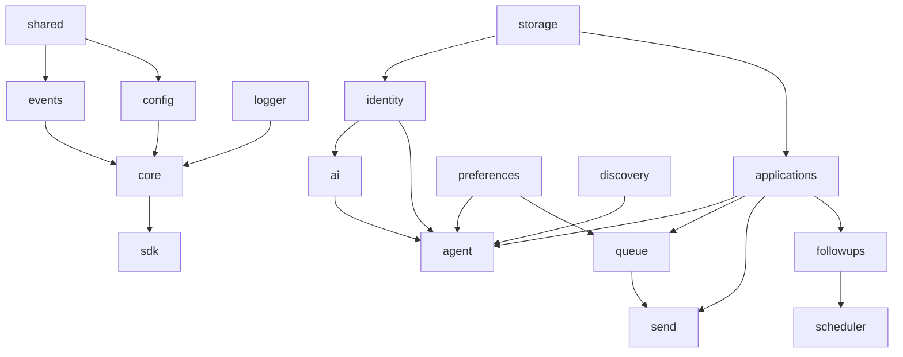

# Package Boundaries

> Who owns what — and who is forbidden from calling whom.

Parent: [OVERVIEW.md](./OVERVIEW.md) · Layout: [MONOREPO.md](./MONOREPO.md)

---

## Boundary principles

1. **One egress package** — career data leaves only through `send` (or send-owned channel adapters).
2. **Agent cannot send** — `agent` prepares and queues; it never holds network credentials for boards/mail.
3. **UI is not a data plane** — renderer talks to host via commands/queries; persistence and models stay in host/packages.
4. **Preferences are policy** — approval gates and quiet hours are enforced in domain/host, not only in button disablement.
5. **Extensions are guests** — they receive capability tokens; they do not import privileged host modules.

---

## Allowed dependency graph (simplified)

```
shared
  ├── events
  ├── config
  └── (ids/result used widely)

logger  (local sinks only)

core  ←  shared + events + logger + config
  ├── ErrorReporter
  └── ServiceRegistry / FoundationKeys

sdk  ←  core + plugin-sdk   (public surface; no ai)

testing  ←  spine helpers

domain packages → core / shared / events / storage …
app → packages/*
```

Legacy shorthand:

```
                    ┌──────────┐
                    │  shared  │
                    └────┬─────┘
                         │
         ┌───────────────┼───────────────┐
         ▼               ▼               ▼
      events          config          (ids)
         │               │
         └───────┬───────┘
                 ▼
          logger + core (kernel)
                 │
                 ▼
                sdk
```

Domain:

```
storage / identity / preferences / … → send (only egress)
agent must not import send
```

---

## Package contracts

### `shared`
- Result / AppError helpers, branded IDs, pipeline stage vocabulary.
- **Depends on:** nothing.

### `events`
- Typed event names and payloads (see [EVENT_SYSTEM.md](./EVENT_SYSTEM.md)).
- In-process bus + `createInMemoryEventBus`.
- **Depends on:** `shared`.
- **Must not:** transmit events off-device.

### `logger`
- Logger / LogSink contracts + console/memory implementations.
- **Must not:** network or cloud crash reporting.

### `config`
- App settings document, defaults, memory store, quiet-hours helpers.
- **Must not:** register AI providers (reserved `ai` fields only).

### `core`
- Kernel: re-exports shared/logger contracts, `ErrorReporter`, service registry.
- **Depends on:** `shared`, `events`, `logger`, `config`.

### `sdk`
- Public barrel for plugins (`HostContext`, safe re-exports) plus extension manager APIs.
- **Must not:** export or boot `@jobjitsu/ai`.
- May re-export `@jobjitsu/extension-sdk` without creating cycles (`sdk` → `extension-sdk` → `core`).

### `testing`
- `expectOk` / `createTestFoundation` helpers for the spine.

### `storage`
- Local repositories for documents, files, embeddings indexes.
- Encryption-at-rest hooks optional; default remains on-device.
- **Must not:** sync to cloud object stores by default.

### `identity`
- Profile, Resume Library, and **Knowledge Base** entries (default home until a split package exists).
- **Public surface:** `getProfile`, `upsertProfile`, `listResumeVersions`, `importResume`, `listKnowledge`, `upsertKnowledge`.
- **Emits:** `Resume.Imported`, `Resume.Generated`, `Knowledge.Updated`.
- **Consumers:** `ai` (Context Builder), `applications`, `agent` (read).
- **Must not:** upload profile remotely; must not treat Timeline rows as knowledge.

### `preferences`
- Fit rules, approval-before-send, notification sound, quiet hours, model path.
- Settings **UI shell** maps here + `config` document (see TERMINOLOGY).
- **Public surface:** `getPreferences`, `updatePreferences`.
- **Emits:** `Preferences.Changed`.
- **Enforced by:** `queue`, `send`, `scheduler`, `agent`.

### `ai`
- **AI Provider** + **Model Manager** + **Context Builder** + **AI Validation**.
- **Public surface:** `health`, `complete`, `embed`, `buildContext`, `validateArtifact`, `loadModel` / `unloadModel`.
- **Emits:** `Ai.Started`, `Ai.Finished`, `Ai.ValidationCompleted`, `Ai.LocalModel*`.
- **Must not:** default to a vendor cloud; optional remote requires explicit user config and honest chrome (never Agent · On-device when remote).

### `agent`
- **Workflow Planner + Engine + AI Task Queue**; specialized agents are **roles/steps**, not separate packages.
- **Public surface:** `startWorkflow`, `pause`, `resume`, `getTaskQueueSnapshot`.
- **Emits:** `Agent.*`, `Workflow.*`.
- Honors pause; enqueues review Queue — never Send.
- **Must not:** call `send.execute` / `approveAndSend`; **must not** bypass review Queue when approval is required.

### `discovery`
- **Job Provider** contract (alias: Discovery `Source`): `list`, `sync`, `normalizeRole`, auth/rate-limit hooks.
- **Public surface:** `registerSource`, `syncSource`, `curate`.
- **Emits:** `Discovery.RolesFound`, `Discovery.RolesCurated`, `Job.Imported`, `Jobs.Synced`.
- Extensions may add sources via [EXTENSION_SYSTEM.md](./EXTENSION_SYSTEM.md).

### `applications`
- Draft lifecycle, versions, tailor metadata, **tracking status** (Application Pipeline).
- **Public surface:** `createDraft`, `updateApplication`, `setStage`, `findDuplicates`.
- **Emits:** `Application.*`.

### `queue`
- Review ritual (approve → send). **Not** the AI Task Queue.
- **Public surface:** `enqueue`, `approve`, `reject`, `clear`, `list`.
- **Emits:** `Queue.*`.
- Transitions to send only after policy checks.

### `send`
- **Outbound boundary.** Applies, submits, or dispatches mail.
- **Public surface:** `approveAndSend` (preferred host command) / `execute` (internal); honest `success|failed|unknown`.
- **Emits:** `Send.*`, triggers `Privacy.EgressRecorded`, may emit `Application.Submitted`.
- Browser automation adapters (Experimental) register as send/extension channels and **never** bypass Queue→Send.

### `followups`
- Reminder intents linked to applications.
- **Public surface:** `schedule`, `dismiss`, `listDue`.
- **Emits:** `FollowUp.*`.

### `timeline`
- Append-only local history for craft continuity and privacy audit.
- **Public surface:** `append`, `query`.
- Consumes durable events — not a Knowledge Base.

### `scheduler`
- See [SCHEDULER.md](./SCHEDULER.md). Local jobs only.

### `plugin-sdk` / `extension-sdk`
- **Plugins** = agent skills. **Extensions** = host contribution points.
- **Must not:** expose raw filesystem or ambient network without capability.

### `ui`
- Presentational `Jj*` components, design tokens, a11y.
- **Must not:** contain egress, call AI Providers, or hold model secrets.

---

## Forbidden couplings

| From → To | Why forbidden |
|-----------|----------------|
| `agent` → `send` | Breaks sovereignty |
| `ui` → `storage` directly | Bypasses host policy |
| `ai` → analytics SaaS with résumé text | Privacy violation |
| `discovery` → `send` | Finding is not applying |
| `plugins` → `app/host` internals | Escape hatch around capabilities |
| Any package → streak/guilt metric stores | Non-goal |
| `applications` → `queue` (import) | Queue owns enqueue API; apps emit facts / host orchestrates |
| `queue` → `send` (import) | Host calls send after approve; queue only records approval |
| `ai` → `applications` (writes) | Agent/host persists drafts; AI returns artifacts |
| `sdk` → `ai` | Public SDK must not boot AI |
| `followups` → `send` (import) | Host/send executes nudge egress |

---

## Domain dependency DAG (allowed)

Direction = “may import / call” (host may compose any package).



**Normative allowed domain edges (summary):**

| Package | May use |
|---------|---------|
| `agent` | `ai`, `applications`, `queue` (enqueue), `discovery`, `preferences`, `identity` (read), `events`, `shared` |
| `queue` | `applications` (read), `preferences`, `events`, `shared` |
| `send` | `queue` (read approval), `applications` (read), `timeline` (write via events), channel adapters |
| `followups` | `applications` (read), `events`, `shared` |
| `ai` | `identity` via **KnowledgeReader** port (read), `shared`, `events` |
| `discovery` | `shared`, `events`, extension sources |
| `timeline` | `events` / storage only — no domain writes upstream |

See also [SYSTEM_ARCHITECTURE.md](./SYSTEM_ARCHITECTURE.md).

---

## Orphan / deferred ownership stubs

| Concern | Owner until epic |
|---------|------------------|
| Mail sync (`Email.Synced`) | Host + `send` channel adapter (Experimental/Future product depth) |
| OS / in-app notifications | Desktop shell (host), calm policy from preferences |
| Browser automation apply-assist | Experimental `send.channel` / extension — never bypass Queue→Send |

No new packages required for H1 Core.

---

## API style across packages

- Prefer **commands** (intent) and **queries** (read models) over shared mutable singletons.
- Cross-package reactions go through **events**, not deep method chains.
- Public package surfaces stay small; internals may be richer.

### `send` channel contract (conceptual)

```text
SendChannel {
  id: string
  send(intent): Promise<SendResult>
}
SendResult { status: "success" | "failed" | "unknown"; destinationClass; attemptId }
```

---

## Fence checklist (normative for tests)

Encode as automated boundary tests when code exists:

1. `agent` must not import `send`
2. `ui` / renderer must not import `ai` or `storage`
3. `discovery` must not import `send`
4. `sdk` must not export/boot `ai`
5. Approval-on → no `Send.Attempted` without `Queue.Approved` (see Trusted Automation exception)
6. Validation fail → no review enqueue for send

---

## Evolution rule

Merging packages for early delivery is allowed **if** the egress and agent/send separation remain enforceable (lint, tests, or module fences). Splitting later must not weaken the outbound boundary.

**Horizon note:** `extension-sdk` and rich host contribution points are **H3–H4** weight; H1 may ship `plugin-sdk` (or merged sdk) only without weakening Agent≠Send.
