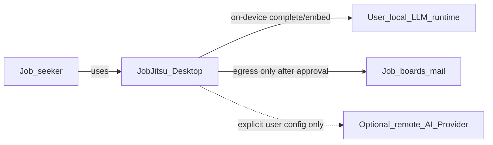
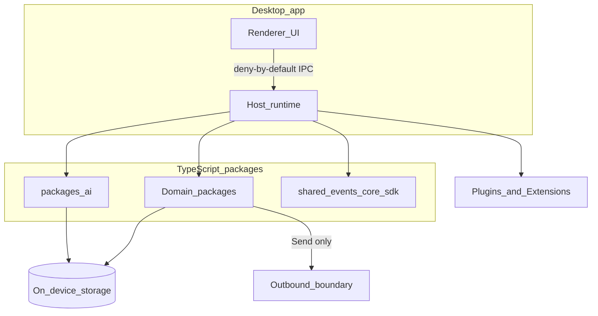
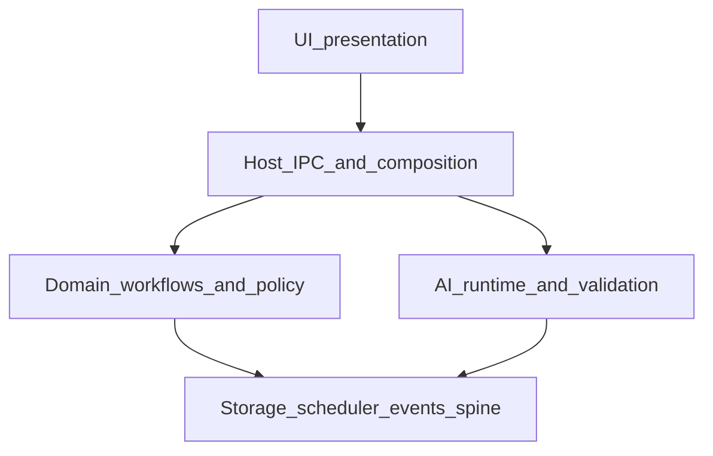
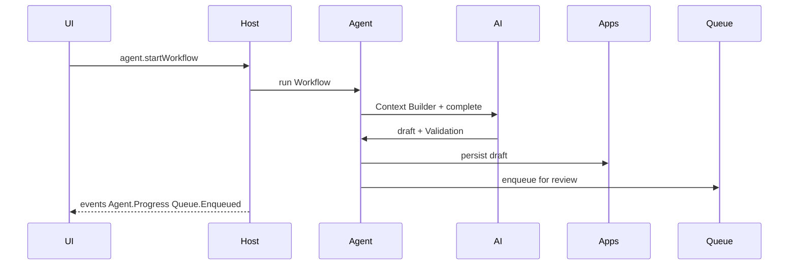
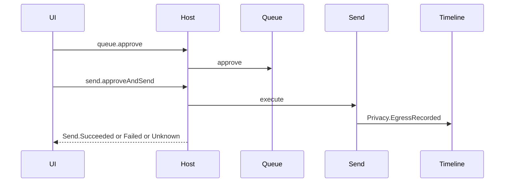

# System Architecture

> **How** JobJitsu is structured as a local-first AI Career Operating System.  
> This document synthesizes the architecture folder into one implementable system view.  
> It does **not** redefine product vision ([../product/](../product/)) or invent features.

**Readiness:** [ARCHITECTURE_READINESS_REPORT.md](../../ARCHITECTURE_READINESS_REPORT.md) (score ≥ 95 required before treating this as implementation-ready).  
**Terms:** [../product/TERMINOLOGY.md](../product/TERMINOLOGY.md) · **Rules:** [../../ARCHITECTURE_PRINCIPLES.md](../../ARCHITECTURE_PRINCIPLES.md) · **What:** [../product/PLATFORM_SPECIFICATION.md](../product/PLATFORM_SPECIFICATION.md)

Detail lives in sibling docs; this file is the **system map**.

| Topic | Detail |
|-------|--------|
| Thesis & laws | [OVERVIEW.md](./OVERVIEW.md) |
| Packages | [MONOREPO.md](./MONOREPO.md) · [PACKAGE_BOUNDARIES.md](./PACKAGE_BOUNDARIES.md) (includes domain DAG + fence checklist) |
| Events | [EVENT_SYSTEM.md](./EVENT_SYSTEM.md) |
| Desktop / IPC | [DESKTOP_ARCHITECTURE.md](./DESKTOP_ARCHITECTURE.md) · [TAURI_TS_RUNTIME.md](./TAURI_TS_RUNTIME.md) |
| AI | [AI_ARCHITECTURE.md](./AI_ARCHITECTURE.md) |
| Workflow / Task Queue / Validation | [WORKFLOW_ENGINE.md](./WORKFLOW_ENGINE.md) |
| Data models | [DATA_MODELS.md](./DATA_MODELS.md) |
| Plugins / Extensions | [PLUGIN_ARCHITECTURE.md](./PLUGIN_ARCHITECTURE.md) · [EXTENSION_SYSTEM.md](./EXTENSION_SYSTEM.md) |
| Scheduler / Testing | [SCHEDULER.md](./SCHEDULER.md) · [TESTING_STRATEGY.md](./TESTING_STRATEGY.md) |
| Decisions | [../adr/README.md](../adr/README.md) |

Root index (entry for contributors): [../../SYSTEM_ARCHITECTURE.md](../../SYSTEM_ARCHITECTURE.md)

---

## 1. System context (C4 — Level 1)

**In scope:** one desktop process family on the user’s machine; local storage; optional user-configured remote AI Providers (honestly labeled — never **Agent · On-device**).

**Out of scope:** JobJitsu cloud backend, SaaS multi-tenant APIs, employer surveillance.

---

## 2. Containers (C4 — Level 2)

| Container | Responsibility | ADR / doc |
|-----------|----------------|-----------|
| Renderer UI | Views, **Agent · On-device** chrome, subscribe to events | ADR 0002, DESKTOP |
| Host runtime | DI, IPC handlers, event bus, load models, enforce policy | ADR 0001, 0013, TAURI_TS_RUNTIME |
| Domain packages | Identity, applications, queue, send, … | PACKAGE_BOUNDARIES |
| `packages/ai` | AI Provider, Model Manager, Context Builder, Validation | ADR 0005, AI_ARCHITECTURE |
| On-device storage | Documents, blobs, optional embeddings index | ADR 0006 |
| Plugins / Extensions | Skills vs host contribution points | ADR 0004, 0012 |

**Law:** UI never calls AI Providers or storage directly — only host commands/queries and event subscriptions ([EVENT_SYSTEM.md](./EVENT_SYSTEM.md) law 7).

---

## 3. Layering

| Layer | May depend on | Must not |
|-------|---------------|----------|
| UI | Host IPC only | `send`, `ai`, `storage` internals |
| Host | All packages via composition | Bypass Queue for Send when approval required |
| Domain | `shared`, `events`, `storage`, peers per boundaries | `agent` → `send` |
| AI | `shared`, identity/knowledge reads | Egress, default cloud |
| Spine | Nothing / minimal | Network sinks |

---

## 4. Runtime request paths

### 4.1 Preparative craft (no egress)

### 4.2 Sovereign send

**AC:** No `Send.Attempted` without `Queue.Approved` when approval-before-send is on (Trusted Automation exception path: [EVENT_SYSTEM.md](./EVENT_SYSTEM.md)).

---

## 5. AI control plane

See [WORKFLOW_ENGINE.md](./WORKFLOW_ENGINE.md) and [AI_ARCHITECTURE.md](./AI_ARCHITECTURE.md).

| Piece | Package | Status |
|-------|---------|--------|
| Workflow Planner / Engine | `agent` | Experimental contract (documented) |
| AI Task Queue | `agent` | Experimental contract |
| Context Builder | `ai` | Core · H1 |
| AI Provider / Model Manager | `ai` | Core · H1 |
| AI Validation | `ai` | Experimental until backlog epic |
| Review Queue | `queue` | Core · H1 |
| Send | `send` | Core · H1 |

Specialized “agents” in the platform specification are **Workflow roles**, not separate packages.

---

## 6. Data & knowledge

Canonical entities and write ownership: [DATA_MODELS.md](./DATA_MODELS.md).

- **Knowledge Base** defaults to `packages/identity` until a split package is justified.
- **Timeline** is audit/craft history — not knowledge facts.
- Application **prep/egress stages** vs **tracking statuses** are mapped explicitly (do not conflate).

---

## 7. Events

SSOT catalog: [EVENT_SYSTEM.md](./EVENT_SYSTEM.md). Typed names live in `packages/events` (code sync of newer names is a follow-up).

Durable allowlist includes Send.*, Privacy.EgressRecorded, Queue approve/reject, Agent.Paused, Preferences.Changed, Plugin/Extension toggles, Application.Submitted.

---

## 8. Extensibility

| Kind | Meaning | Doc |
|------|---------|-----|
| **Plugin** | Capability-gated agent skill | PLUGIN_ARCHITECTURE |
| **Extension** | Host contribution (Job Provider, send channel, UI, …) | EXTENSION_SYSTEM |

Job Providers implement the discovery `Source` / Job Provider contract ([PACKAGE_BOUNDARIES.md](./PACKAGE_BOUNDARIES.md)). Browser automation apply-assist is **Experimental** and must not bypass Queue → Send.

---

## 9. Desktop shell

- **Target host:** Tauri (ADR 0001); current foundation may run Vite-first ([TAURI_TS_RUNTIME.md](./TAURI_TS_RUNTIME.md)).
- **UI:** React (ADR 0002).
- **IPC:** Deny-by-default catalog in [DESKTOP_ARCHITECTURE.md](./DESKTOP_ARCHITECTURE.md).
- **IA (H1):** Applications, Queue, Follow-ups, Agent, Preferences, Timeline/Logs.
- **Chrome:** **Agent · On-device** when local; remote labeled honestly.

---

## 10. Cross-cutting

| Concern | Approach |
|---------|----------|
| Config / Preferences | `config` document + `preferences` façade; Settings UI = shell |
| Scheduler | Local jobs only ([SCHEDULER.md](./SCHEDULER.md), ADR 0010) |
| Logging | Local sinks; redact prompts by default |
| Testing | Privacy and agent≠send must-pass ([TESTING_STRATEGY.md](./TESTING_STRATEGY.md), ADR 0007) |
| Errors | Host ErrorReporter; calm recovery copy (brand) |

---

## 11. Non-goals (architecture defects if built)

From [../product/NON_GOALS.md](../product/NON_GOALS.md) and OVERVIEW laws:

- JobJitsu cloud holding career data
- Agent-owned send / spray autopilot
- UI→AI Provider calls
- Silent cloud AI fallback
- Urgency / streak systems as product metrics

---

## 12. Implementation guidance

1. Prefer vertical slices ([../backlog/VERTICAL_SLICES.md](../backlog/VERTICAL_SLICES.md)).
2. Enforce fences with tests/lint (`agent` ↛ `send`, UI ↛ `ai`).
3. Emit catalog events with PII-minimized payloads.
4. Treat Experimental modules as optional until backlog admits them.
5. Process: [../../DEFINITION_OF_DONE.md](../../DEFINITION_OF_DONE.md) · [../../ENGINEERING_CONSTITUTION.md](../../ENGINEERING_CONSTITUTION.md).

---

## Document control

| Field | Value |
|-------|--------|
| Status | Living system map |
| Supersedes | Unfilled root architecture prompt stubs |
| Does not replace | Sibling deep-dive docs or ADRs |
