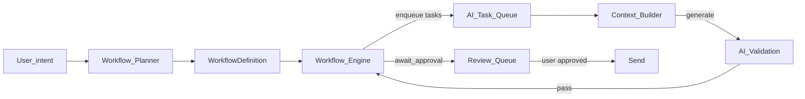
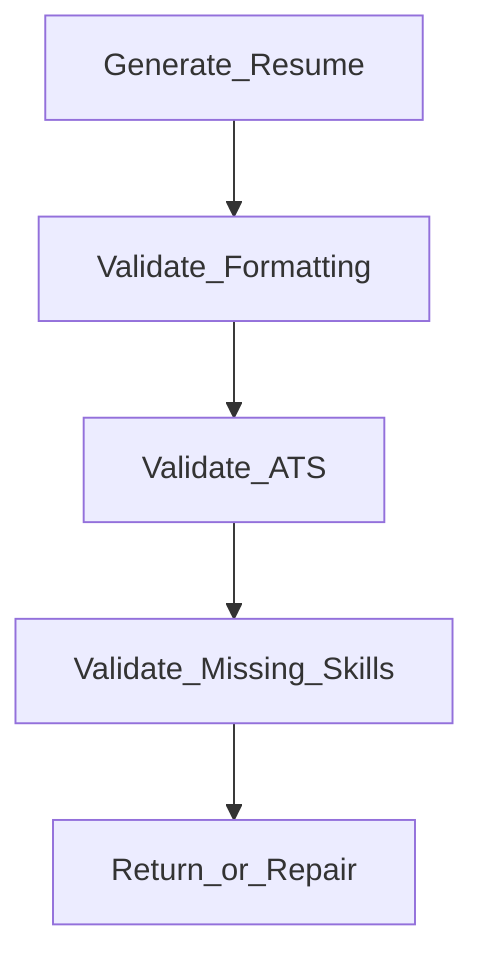

# AI Workflow Engine & Task Queue

> Declarative Workflows, AI Task Queue, Context Builder hooks, and AI Validation — control plane for Local Intelligence.

Parent: [OVERVIEW.md](./OVERVIEW.md) · Product: [../product/PLATFORM_SPECIFICATION.md](../product/PLATFORM_SPECIFICATION.md) · Terms: [../product/TERMINOLOGY.md](../product/TERMINOLOGY.md)

**Feature status:** Experimental until backlog epics admit H1 AC — architectural contract for the **existing** platform design (not a new product idea).

---

## Thesis

The JobJitsu Agent plans work as a **Workflow**. The **Workflow Engine** runs steps. The **AI Task Queue** schedules unit work so models run only when needed. **Context Builder** assembles prompts. **AI Validation** gates artifacts before they reach the review **Queue** or user.

User chrome stays **JobJitsu Agent**. Review **Queue** (approve → Send) is distinct from **AI Task Queue**.



---

## Ownership

| Concern | Package |
|---------|---------|
| Planner + Workflow Engine + AI Task Queue | `packages/agent` |
| Context Builder + Model Manager + AI Provider | `packages/ai` |
| AI Validation (deterministic checks) | `packages/ai` (orchestrated by agent steps) |
| Review Queue | `packages/queue` |
| Send | `packages/send` only |

Specialized “Resume Agent”, “Cover Letter Agent”, etc. in the platform specification are **Workflow roles / step executors** inside the Agent host — not separate packages by default.

---

## WorkflowDefinition (conceptual)

```text
WorkflowDefinition {
  id: WorkflowId
  name: string                  // e.g. "application.apply"
  steps: Step[]
}

Step {
  id: string
  kind: validate | analyze | retrieve | generate | prepare
       | await_approval | egress_intent | persist | cleanup
  role?: string                 // e.g. "resume", "cover_letter", "knowledge"
  inputs: string[]
  outputs: string[]
  onFail: fail | repair | wait_user
}
```

`egress_intent` may only enqueue review **Queue** items or emit send intents — **never** call `send.execute` / network.

---

## AI Task Queue states

| State | Meaning |
|-------|---------|
| `Pending` | Accepted; not started |
| `Running` | Executor active |
| `Waiting` | Blocked on approval, dependency, or user |
| `Completed` | Success; artifacts available |
| `Failed` | Terminal failure; calm recovery |
| `Cancelled` | Pause or explicit cancel |

**AC**

- `Agent.Paused` → Running tasks Cancelled or frozen per policy; Pending retained; review Queue intact.
- Models unload after drain or idle timeout (`cleanup` / Unload Models).
- UI may show: label + progress + “N tasks remaining” (calm; no urgency).

---

## Context Builder

Canonical name: **Context Builder** (alias: context assembler in older text).

**Contract (conceptual)**

```text
ContextRequest { taskKind, workflowRunId?, entityRefs, budgetHints }
ContextBundle { slices[], provenance[] }
// slices default order for apply-craft:
// Profile → Resume → Projects → Achievements → CurrentJob → …
PromptAssembly { templateId, bundle } → provider.complete
```

Must retrieve from **Knowledge Base** when grounded facts exist. Must not dump full Timeline into every prompt.

---

## AI Validation

Do not trust the first model output.

Canonical resume path:



**AC**

- Validation fail → does **not** enqueue review Queue for send.
- Warn may proceed with visible findings.
- Bounded repair retries only; then wait_user.
- Prefer deterministic checks; honest ATS language (no “beats every ATS”).

---

## Events (emit)

See [EVENT_SYSTEM.md](./EVENT_SYSTEM.md): `Workflow.Started|Completed|Failed`, `Ai.Started|Finished`, `Ai.ValidationCompleted`.

---

## Application Workflow (canonical)

Matches platform specification Apply chain; **Submit** = user-owned Send after approval.

| Step | Kind | Notes |
|------|------|-------|
| Validate Resume (input) | validate | Deterministic |
| Analyze Job | analyze | Context Builder + AI Provider |
| Retrieve Knowledge | retrieve | Knowledge Base |
| Generate Resume | generate | + Validation pipeline |
| Generate Cover Letter | generate | + Validation |
| Prepare Browser Automation | prepare | Experimental; no egress |
| Wait for Approval | await_approval | Review Queue |
| Submit | egress via Send | User / Send package only |
| Update Timeline | persist | Local audit — not remote analytics |
| Unload Models | cleanup | |

---

## Non-goals

- Chatbot as control plane
- Silent auto-submit
- Always-on model residency
- Conflating AI Task Queue with review Queue
