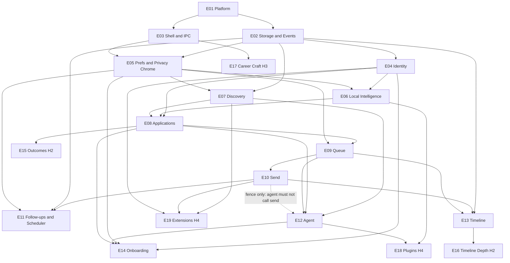
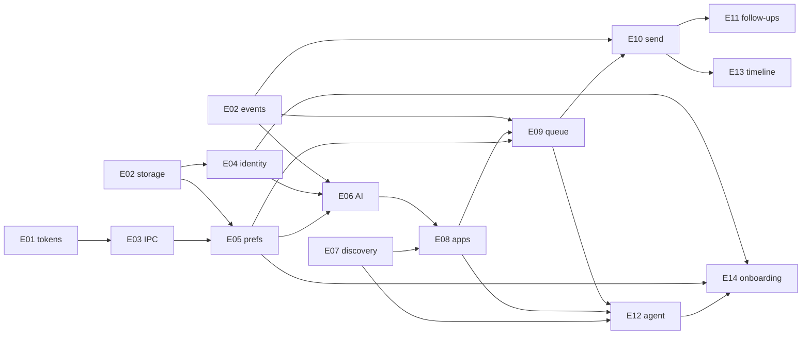

# Dependency Graph

How backlog work unlocks. Prefer finishing an earlier **wave** before starting the next. Within a wave, tasks can proceed in parallel if their `Depends` are satisfied.

Full task deps: [TECHNICAL_TASKS.md](./TECHNICAL_TASKS.md).

---

## Epic-level graph

Dashed edge E10→E12 means **policy/fence dependency** (tests proving agent does not import/execute send), not a feature call edge.

---

## Feature critical path (H1 spine)

---

## Build waves

### Wave 0 — Repo boots
**Goal:** Dev can run UI shell with tokens.  
**Epics:** E01  
**Exit:** Tauri window + React + dark canvas.

### Wave 1 — Data & chrome spine
**Goal:** Persist data; navigate app; talk host↔UI.  
**Epics:** E02, E03 (parallel after E01)  
**Exit:** Storage roundtrip; event bus test; nav + IPC ping; JjButton.

### Wave 2 — User trust surface
**Goal:** Résumé local; prefs; honest pill.  
**Epics:** E04, E05  
**Exit:** Import resume; approval default on; Local LLM pill mounted.

### Wave 3 — Intelligence & craft objects
**Goal:** Tailor drafts from local roles.  
**Epics:** E06, E07, then E08  
**Exit:** Fake provider tailor; CSV roles; applications list/detail.

### Wave 4 — Sovereignty path
**Goal:** Review → approve → egress audited.  
**Epics:** E09, E10, E13 (timeline sink)  
**Exit:** canSend enforced; file-export channel; egress on timeline; agent̸→send fence green.

### Wave 5 — Agent & nudges
**Goal:** Preparative agent + polite follow-ups.  
**Epics:** E12, E11 (scheduler can start once E02+E05 ready; full send hook after E10)  
**Exit:** Pause/resume; prep enqueues; follow-up due caution; no auto-send.

### Wave 6 — First-run polish & must-pass
**Goal:** Ship-quality H1 companion.  
**Epics:** E14 + QA tasks  
**Exit:** Three-beat onboarding; empty states; privacy must-pass tests green.

### Wave 7 — H2 depth
**Epics:** E15, E16  
**Exit:** Outcomes + deeper timeline without guilt UX.

### Wave 8 — H3 shells
**Epics:** E17 (admission test per module before deep tasks)

### Wave 9 — H4 ecosystem
**Epics:** E18, E19  
**Exit:** Sample plugin fail-closed; export on demand.

---

## Parallelization tips

| Parallel tracks | After |
|-----------------|-------|
| Storage ‖ Events ‖ UI tokens | Wave 0 |
| Identity ‖ Preferences UI | Wave 1 |
| AI fake provider ‖ CSV discovery | Wave 2 |
| Applications UI ‖ Queue domain | Wave 3 (apps entity first) |
| Timeline UI ‖ Send toasts | Wave 4 |
| Agent UI ‖ Scheduler core | Wave 4/5 |

---

## Hard constraints (never invert)

1. **E10 before any “auto apply” idea** — and still never auto apply.  
2. **E09 policy before E10 execute** when approval default on.  
3. **E06 fake provider before real local runner** for unblocking UI.  
4. **E12 must not gain a dependency on E10 execute** — only shared policy types/tests.  
5. **No H3/H4 work that violates non-goals** to “go faster.”

---

## Mapping to ADRs

| Wave | ADRs exercised |
|------|----------------|
| 0 | 0001 Tauri, 0002 React, 0008 monorepo, 0011 TS |
| 1 | 0003 events, 0006 storage, 0013 IPC |
| 2–3 | 0005 AI |
| 4 | 0009 send boundary, 0007 testing |
| 5 | 0010 scheduler |
| 9 | 0004 plugins, 0012 extensions |
