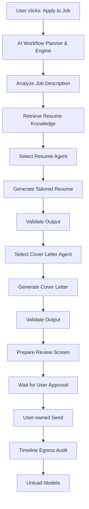
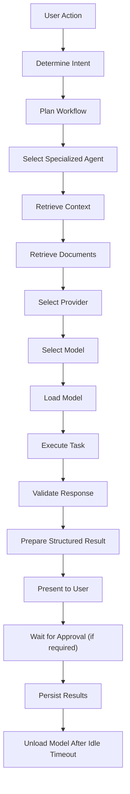
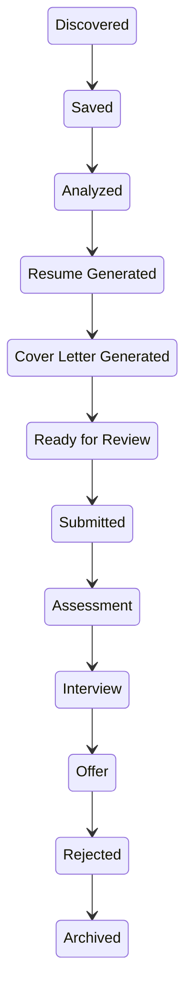
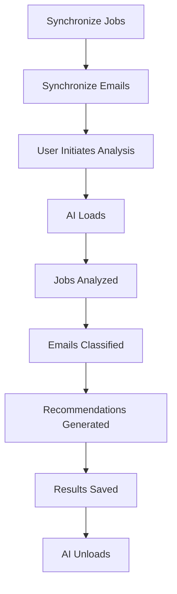

# JobJitsu Platform Specification

Version: 2.0

> The gentle art of landing the job.
>
> On-device. On-target. On your terms.

---

## Purpose

This document is the authoritative **functional** specification of JobJitsu platform behavior—**what** the platform should do. It is not the sole product authority.

Companion documents:

- [PRODUCT_VISION.md](./PRODUCT_VISION.md) — product vision
- [FEATURES.md](./FEATURES.md) — modules and Feature Status (**Core** / **Experimental** / **Future**)
- [TERMINOLOGY.md](./TERMINOLOGY.md) — canonical terms
- [PRINCIPLES.md](./PRINCIPLES.md) — product principles
- [NON_GOALS.md](./NON_GOALS.md) — deliberate non-goals
- [ROADMAP.md](./ROADMAP.md) — sequencing horizons
- [../architecture/OVERVIEW.md](../architecture/OVERVIEW.md) — architecture overview (**how**)
- [../../ARCHITECTURE_PRINCIPLES.md](../../ARCHITECTURE_PRINCIPLES.md) — architectural rules

This document intentionally describes **what JobJitsu should do**, not **how it should be implemented**.

Feature Status (**Core** / **Experimental** / **Future**) lives in [FEATURES.md](./FEATURES.md). Implementation details belong in Architecture documentation.

---

## Product Vision

JobJitsu is an open-source, local-first AI Career Operating System.

Rather than being another resume generator or job application tool, JobJitsu becomes the central operating system for an individual's professional career.

The platform assists users throughout every stage of their career lifecycle:

- Building professional profiles
- Managing resumes
- Tailoring applications
- Discovering opportunities
- Researching companies
- Tracking recruiter relationships
- Preparing for interviews
- Following up professionally
- Measuring progress
- Planning future career growth

JobJitsu exists to remove repetitive work while keeping users fully in control.

Artificial Intelligence is used to assist—not replace—the user's judgment.

---

## Mission

Build the world's best open-source AI Career Operating System that runs locally, respects user privacy, and empowers people rather than collecting their data.

---

## Core Principles

Every feature added to JobJitsu must reinforce the following principles.

### Privacy First

User career data belongs entirely to the user.

JobJitsu should never require a JobJitsu cloud backend for its core functionality. Optional user-configured remote AI Providers are allowed when honestly labeled.

The platform should minimize external communication whenever possible.

---

### Local First

Core functionality should continue working without internet access.

External services enhance the experience but should never become mandatory.

---

### Human in Control

The user always has the final decision.

JobJitsu may suggest.

JobJitsu may automate.

JobJitsu may organize.

But JobJitsu should never silently make important decisions on behalf of the user.

---

### AI as an Assistant

Artificial Intelligence should augment human capability.

It should not replace critical thinking.

Every AI-generated result should be reviewable and editable.

---

### Open Source

Every architectural decision should be transparent.

Every contributor should be welcomed.

Everything should be documented.

Community contributions should be encouraged.

---

### Extensible

Everything should be replaceable.

Nothing should depend on a single vendor.

Every major capability should be exposed through plugin interfaces.

---

### Modular

The application should consist of independent modules with clear responsibilities.

Features should be composable rather than tightly coupled.

---

### Test Driven

Every feature must be accompanied by automated tests.

No implementation should be considered complete without testing.

---

### Documentation First

Architecture should be documented before implementation.

Implementation should update documentation whenever behavior changes.

---

## Platform Overview

JobJitsu is a native desktop application designed for:

- macOS
- Windows
- Linux

The application should feel lightweight, fast, responsive, and native to each operating system.

The user should simply install the application, launch it, complete onboarding, and begin working immediately.

No terminal.

No manual configuration.

No Docker.

No server deployment.

No JobJitsu backend or cloud account required.

Everything should happen from a polished desktop application.

---

## What JobJitsu Manages

JobJitsu manages every major aspect of the job search process.

Examples include:

- Personal profile
- Resume library
- Cover letters
- Applications
- Recruiters
- Emails
- Interviews
- Companies
- AI workflows
- Career knowledge
- Portfolio information
- Career analytics
- Notes
- Follow-ups
- Tasks
- Calendar reminders
- Documents

The goal is to replace dozens of disconnected tools with one cohesive experience.

---

## The AI Philosophy

Artificial Intelligence is one component of JobJitsu.

It is not the product itself.

Users should not need to understand language models, prompt engineering, or AI infrastructure to benefit from the platform.

JobJitsu should hide complexity while remaining transparent about important decisions.

Whenever AI performs work, the application should clearly explain:

- Why the AI was used
- Which provider was selected
- Which model was selected
- Which information was used
- Any assumptions that were made
- Any recommendations for the user

AI should be explainable rather than magical.

---

## The AI Agent

The AI Agent is the heart of JobJitsu.

Rather than acting as a chatbot, the Agent acts as an intelligent career assistant capable of coordinating multiple specialized workflows.

The Agent should understand:

- the user's career history
- previous resumes
- applications
- recruiter conversations
- interview history
- skills
- goals
- preferences

The Agent should make intelligent recommendations using this information while remaining transparent about every decision.

The Agent should never remain continuously active.

Instead it should operate using an event-driven lifecycle.

It wakes only when required.

It performs work.

It returns results.

It becomes idle again.

This minimizes memory usage while preserving a responsive user experience.

---

## Agent Responsibilities

The AI Agent is responsible for:

- Resume optimization
- Resume tailoring
- Cover letter generation
- Job analysis
- Company research
- Recruiter assistance
- Email drafting
- Email summarization
- Follow-up generation
- Interview preparation
- Skill analysis
- Career recommendations
- Application planning
- Prompt orchestration
- Context retrieval
- AI provider selection
- Model selection
- Workflow planning

The Agent should never directly perform irreversible external actions unless the user has explicitly approved them.

Human approval remains the default.

---

## AI Agent Framework

The AI Agent Framework is the intelligence layer of JobJitsu.

Rather than relying on a single monolithic AI assistant, JobJitsu uses a collection of specialized agents coordinated by the AI Workflow Planner & Engine.

Each agent has a clearly defined responsibility.

The user only interacts with a single "JobJitsu Agent" while the AI Workflow Planner & Engine coordinates Workflows, the Task Queue, and specialized agents.

This architecture improves:

- Maintainability
- Reliability
- Extensibility
- Performance
- Testing
- Debugging
- Future expansion

New agents should be addable without modifying the platform core.

---

## AI Workflow Planner & Engine

The AI Workflow Planner & Engine is the brain of the AI framework.

It does not generate content itself.

Instead, it plans **Workflows**, schedules work on the **Task Queue**, and delegates tasks. The **Context Builder** assembles minimal prompt context before inference.

Responsibilities include:

- Understanding user intent
- Breaking requests into tasks
- Selecting specialized agents
- Retrieving relevant context (via Context Builder)
- Selecting AI providers
- Selecting AI models
- Monitoring execution
- Combining results
- Validating responses
- Returning structured outputs

Example workflow:

The AI Workflow Planner & Engine is responsible for coordinating every AI Workflow.

---

## Resume Agent

Purpose

Understand and optimize resumes.

Responsibilities

- Parse imported resumes
- Extract structured information
- Detect achievements
- Detect technologies
- Detect responsibilities
- Score resumes
- Tailor resumes
- Optimize for ATS
- Generate new resume versions
- Compare resume versions
- Export resumes

Inputs

- Resume
- User profile
- Job description
- Preferences

Outputs

- Tailored resume
- Resume analysis
- Resume score
- Recommendations

---

## Cover Letter Agent

Purpose

Generate personalized cover letters.

Responsibilities

- Generate new cover letters
- Tailor to company
- Tailor to recruiter
- Match writing style
- Rewrite existing cover letters
- Compare multiple versions

Outputs

- Cover letter
- Summary
- Writing suggestions

---

## Job Research Agent

Purpose

Understand opportunities before the user applies.

Responsibilities

- Analyze job descriptions
- Extract technologies
- Estimate required experience
- Identify missing skills
- Research company
- Summarize company
- Score opportunity
- Detect potential concerns

Outputs

- Job summary
- Skill match
- Resume fit
- Company summary
- Recommendations

---

## Recruiter Agent

Purpose

Manage recruiter relationships.

Responsibilities

- Track recruiter interactions
- Suggest follow-ups
- Maintain communication history
- Generate personalized messages
- Detect recruiter activity

Outputs

- Follow-up reminders
- Suggested messages
- Relationship timeline

---

## Email Agent

Purpose

Organize career-related email communication.

Responsibilities

- Sync inbox
- Classify emails
- Detect interviews
- Detect assessments
- Detect offers
- Detect recruiter messages
- Draft replies
- Summarize conversations

Outputs

- Email summaries
- Draft replies
- Follow-up reminders

---

## Interview Agent

Purpose

Prepare users for interviews.

Responsibilities

- Company research
- Behavioral questions
- Technical questions
- Resume-based questions
- Mock interviews
- Study plans
- Coding preparation
- System design preparation

Outputs

- Interview guides
- Practice questions
- Study plans

---

## Career Agent

Purpose

Help users think long-term.

Responsibilities

- Skill gap analysis
- Career planning
- Technology trends
- Salary insights
- Learning recommendations
- Career progression

Outputs

- Career roadmap
- Skill recommendations
- Growth opportunities

---

## Model Manager Agent

Purpose

Select the most appropriate AI provider and model for each task.

Responsibilities

- Detect available providers
- Detect installed models
- Benchmark performance
- Recommend models
- Switch providers
- Load models
- Unload models
- Monitor memory usage
- Monitor inference speed

The user should rarely need to manually select models.

---

## Knowledge Agent

Purpose

Retrieve relevant information before AI inference.

Responsibilities

- Search user knowledge
- Search resume history
- Search projects
- Search achievements
- Search recruiter notes
- Search application history
- Retrieve relevant context

The Knowledge Agent should minimize hallucinations by providing grounded context to other agents.

---

## AI Execution Lifecycle

Every AI request follows a predictable workflow.

The execution lifecycle should be observable and debuggable.

Users should be able to inspect what happened during any AI workflow.

---

## AI Context Retrieval

Before generating any content, the AI should retrieve relevant information.

Possible context sources include:

- User profile
- Resume
- Previous resume versions
- Projects
- Skills
- Career history
- Cover letters
- Recruiter notes
- Company notes
- Job descriptions
- Interview notes
- Portfolio
- GitHub
- Personal preferences

Only relevant information should be retrieved.

Irrelevant context should never be sent to AI models.

---

## Prompt Templates

Prompt templates should not be hardcoded.

Prompt templates should be versioned.

Prompt templates should support variables.

Prompt templates should be replaceable.

Prompt templates should support plugins.

Examples:

- Resume generation
- Cover letters
- Follow-up emails
- Interview preparation
- Job analysis
- Career coaching

Community members should be able to contribute improved prompts without modifying the application code.

---

## Human Approval

JobJitsu should never silently perform irreversible actions.

Before performing actions such as:

- Sending emails
- Applying for jobs
- Contacting recruiters
- Uploading resumes
- Uploading cover letters
- Accepting offers
- Modifying external services

The platform should display a review screen.

Trusted Automation may be enabled by the user.

Even then, the user should always have visibility into completed actions.

---

## AI Provider Architecture

JobJitsu is provider-agnostic.

The platform should never depend on a single AI vendor.

Instead, all AI functionality should be accessed through a common provider interface.

Every provider must implement the same capabilities while allowing provider-specific features to remain available.

Users should be free to:

- Use local models only
- Use user-configured remote AI Providers only
- Mix local and remote AI Providers
- Configure providers for specific tasks
- Disable providers entirely

The rest of the application should not need to know which provider generated the result.

---

## Provider Categories

JobJitsu supports two primary categories of AI providers.

### Local Providers

Local providers are the recommended default. When the on-device path is active, status chrome should show **Agent · On-device** (not “Local LLM” in the UI).

Advantages include:

- Complete privacy
- No recurring costs
- Offline capability
- No API limits
- No vendor lock-in
- Faster repeated workflows
- User ownership of data

Supported providers may include:

- Ollama
- LM Studio
- MLX
- llama.cpp
- vLLM (future)
- Jan (future)
- GPT4All (future)

The architecture should allow additional providers to be added through plugins.

---

### Remote AI Providers

Remote AI Providers are optional and user-configured. JobJitsu does not operate a backend that runs AI on the user's behalf.

Users may choose to connect their own paid AI services when they require higher quality models, faster inference, larger context windows, or advanced reasoning capabilities.

Examples include:

- OpenAI
- Anthropic
- Google Gemini
- OpenRouter
- Groq
- Together AI
- DeepSeek
- Mistral
- xAI
- Cohere
- Azure OpenAI

Additional providers should be installable through plugins.

Remote AI Providers should never become mandatory.

---

## User-Owned API Keys

JobJitsu does not provide AI subscriptions.

JobJitsu does not proxy AI requests.

JobJitsu does not resell API access.

Instead, users simply connect their own AI accounts.

The setup flow should be:

Select Provider

↓

Paste API Key

↓

Validate Credentials

↓

Save Securely

↓

Provider Ready

API keys should always remain under the user's control.

Credentials should never be stored as plain text.

The operating system's secure credential storage should always be used whenever possible.

Examples:

macOS

- Keychain

Windows

- Credential Manager

Linux

- Secret Service / Keyring

---

## Provider Preferences

Users should be able to configure default providers globally or per task.

Examples:

Resume Generation

↓

OpenAI

Cover Letters

↓

Claude

Job Analysis

↓

Local Ollama

Interview Practice

↓

Gemini

Coding Questions

↓

Qwen Coder (Local)

Email Drafting

↓

DeepSeek

The platform should automatically use the configured provider whenever possible.

---

## Automatic Provider Selection

Users may optionally allow JobJitsu to select providers automatically.

Selection criteria may include:

- Privacy preference
- Cost
- Model quality
- Speed
- Available memory
- Context length
- GPU availability
- Offline status

The decision process should always be transparent.

Users should be able to see why a provider was selected.

---

## AI Model Catalog

JobJitsu should maintain a curated catalog of recommended AI models.

The catalog should evolve as new open-source models become available.

The catalog should not simply list every available model.

Instead, it should recommend high-quality, well-tested options.

Each model should include:

- Name
- Version
- Provider
- Parameters
- Quantization
- Download Size
- RAM Requirement
- VRAM Requirement
- Recommended Hardware
- Context Window
- License
- Offline Support
- Speed Rating
- Quality Rating
- Best Use Cases

The catalog should be updateable independently of application releases whenever possible.

---

## Model Categories

Models should be grouped by capability.

Examples include:

### General Purpose

Balanced models suitable for most AI tasks.

---

### Resume Models

Optimized for writing resumes and cover letters.

---

### Coding Models

Optimized for software engineering tasks.

---

### Reasoning Models

Optimized for planning, analysis, and complex decision making.

---

### Embedding Models

Used for semantic search and retrieval.

---

### Vision Models

Used for OCR, screenshots, scanned resumes, and image understanding.

---

### Multimodal Models

Capable of processing both text and images.

---

## Official Recommendations

The project maintainers should publish recommended models.

Examples:

Best Overall

Best Laptop Model

Best Coding Model

Best Resume Model

Best Interview Model

Best Fast Model

Best Small Model

Best Low Memory Model

Best Multilingual Model

Best Offline Model

Community recommendations should be reviewed regularly.

---

## AI Configuration Profiles

Many users will not know which models to install.

JobJitsu should provide recommended presets.

### Lightweight

Designed for older laptops.

Prioritizes:

- Speed
- Low RAM
- Small downloads

---

### Balanced

Recommended for most users.

Balances quality and performance.

---

### Professional

Designed for developers and power users.

Prioritizes output quality while remaining practical.

---

### Maximum Quality

Designed for high-end workstations.

Prioritizes reasoning quality over inference speed.

---

### Custom

Allows complete manual configuration.

---

## Model Downloads

The application should help users install local models.

Capabilities include:

- Browse recommended models
- View hardware requirements
- Download models
- Pause downloads
- Resume downloads
- Delete models
- Upgrade models
- View installed models

The application should clearly display estimated storage requirements before downloading.

---

## AI Playground

JobJitsu should include an AI Playground.

The Playground allows users to experiment with AI providers without affecting production workflows.

Capabilities include:

- Test prompts
- Compare providers
- Compare models
- Compare response quality
- Measure inference speed
- Save prompts
- Share prompt templates
- Benchmark models
- Tune generation settings
- View context sent to AI
- Debug prompts

The Playground should become the primary environment for testing prompts before they are integrated into production workflows.

---

## Prompt Library

Prompt templates should be first-class assets.

The platform should support:

- Prompt versioning
- Categories
- Variables
- Preview
- Testing
- Import
- Export
- Community sharing

Examples:

- Resume prompts
- Cover letter prompts
- Interview prompts
- Follow-up prompts
- Company research prompts
- Job analysis prompts

Prompt templates should be replaceable without modifying source code.

---

## Resource Management

Running local AI models consumes significant resources.

JobJitsu should actively manage system resources.

Examples:

- Load models only when required
- Unload idle models
- Queue requests
- Prevent duplicate inference
- Limit concurrent workloads
- Monitor RAM
- Monitor GPU memory
- Display current resource usage

Users should always understand why system resources are being used.

---

## Offline Strategy

The platform should continue functioning even when internet access is unavailable.

Offline functionality should include:

- Resume generation
- Cover letter generation
- Resume tailoring
- Career knowledge
- Prompt execution
- Local AI
- Notes
- Analytics
- Search
- Application tracking

Internet should only be required for:

- Downloading models
- Syncing email
- Searching online job boards
- Remote AI Providers (user-configured)
- Software updates

Core functionality should remain available offline.

---

## Future AI Capabilities

The architecture should support future AI enhancements without requiring major redesign.

Potential future capabilities include:

- Voice conversations
- Real-time interview coaching
- Speech-to-text
- Text-to-speech
- Meeting summarization
- Multi-agent collaboration
- Autonomous research
- Long-running workflows
- Local fine-tuning
- Personal memory systems
- Vision-assisted job applications
- AI-generated portfolio websites
- AI-powered networking assistant

The architecture should remain flexible enough to support capabilities that do not yet exist.

---

## User Profile

The User Profile is the foundation of the entire platform.

Rather than repeatedly asking users for the same information, JobJitsu should maintain a structured professional profile that every module can reference.

The profile should evolve over time as the user's career grows.

The user should always remain in control of their profile data.

---

## Profile Information

The platform should support storing information including, but not limited to:

### Personal Information

- Full Name
- Preferred Name
- Email Addresses
- Phone Numbers
- Location
- Time Zone
- Nationality (optional)
- Work Authorization
- Visa Status (optional)
- Preferred Languages

---

### Professional Information

- Current Role
- Years of Experience
- Seniority Level
- Industry
- Career Summary
- Professional Headline

---

### Employment Preferences

- Preferred Job Titles
- Preferred Industries
- Preferred Locations
- Remote Preferences
- Hybrid Preferences
- On-site Preferences
- Relocation Preferences
- Employment Type
- Contract Preferences
- Salary Expectations
- Notice Period
- Availability

---

### Skills

The platform should maintain structured skill data.

Examples:

- Programming Languages
- Frameworks
- Libraries
- Databases
- Cloud Platforms
- DevOps
- Mobile
- Web
- AI
- Leadership
- Soft Skills

Each skill may include:

- Years of experience
- Self confidence
- Last used
- Proficiency
- Related projects

---

### Experience

Each work experience should become structured knowledge.

Rather than treating experiences as plain text, JobJitsu should understand:

- Company
- Position
- Start Date
- End Date
- Technologies
- Responsibilities
- Achievements
- Leadership
- Team Size
- Business Impact
- Metrics
- Promotions

---

### Projects

Projects should become reusable knowledge.

Examples:

- Name
- Description
- Technologies
- Architecture
- Responsibilities
- Screenshots
- Links
- GitHub
- Website
- Challenges
- Solutions
- Lessons Learned

Projects should later become reusable context for resumes, interviews and cover letters.

---

### Education

Support:

- Degrees
- Certifications
- Courses
- Bootcamps
- Online Learning
- Awards

---

## Resume Intelligence

JobJitsu should not think of resumes as files.

Instead, resumes become structured representations of the user's professional history.

The platform should separate:

Knowledge

↓

Presentation

The user's experience exists once.

Resumes become different presentations of the same knowledge.

This eliminates duplication while making tailoring significantly easier.

---

## Resume Library

Users should be able to maintain multiple resumes.

Examples:

General Resume

↓

Frontend Resume

↓

Backend Resume

↓

React Native Resume

↓

Engineering Manager Resume

↓

Startup Resume

↓

Enterprise Resume

Each resume should remain linked to the same knowledge base.

---

## Resume Import

Users should be able to import resumes from multiple formats.

Supported examples:

- PDF
- DOCX
- Markdown
- HTML
- TXT

Imported resumes should be parsed into structured knowledge.

The original file should also be preserved.

---

## Resume Versioning

Every generated resume should become a version.

Users should be able to:

- Compare versions
- Restore versions
- Duplicate versions
- Rename versions
- Archive versions

Version history should be searchable.

---

## Resume Templates

Templates should be independent from resume data.

Users should be able to switch templates without rewriting resume content.

Templates may include:

- Modern
- Minimal
- ATS Friendly
- Executive
- Academic
- Creative

Future templates should be installable through extensions.

---

## Resume Tailoring

Resume tailoring should become one of the platform's strongest capabilities.

Given:

- Job Description
- Company
- Recruiter
- User Preferences

The platform should intelligently:

- Prioritize relevant experience
- Reorder achievements
- Highlight matching technologies
- Rewrite bullet points
- Improve measurable impact
- Remove less relevant content
- Match job terminology
- Improve ATS compatibility

Users should always preview changes before saving.

---

## Resume Analysis

The Resume Agent should analyze resumes on demand—when the user requests analysis or when a relevant event occurs—not continuously in the background.

Possible insights include:

- ATS compatibility
- Missing keywords
- Weak bullet points
- Passive language
- Missing metrics
- Duplicate content
- Formatting issues
- Readability
- Estimated recruiter reading time

The system should explain every recommendation.

---

## Resume Scoring

Scores should not be arbitrary.

The platform should explain:

- Why the score exists
- Which areas are strong
- Which areas need improvement
- Confidence level

Scores should evolve as better analysis methods become available.

---

## Cover Letter Intelligence

Cover letters should become reusable assets.

The platform should support:

- Company-specific versions
- Recruiter-specific versions
- Industry-specific versions
- Multiple writing styles
- Different lengths

Generated cover letters should always remain editable.

---

## Cover Letter Styles

Examples:

- Professional
- Friendly
- Executive
- Startup
- Technical
- Formal
- Conversational

Users should be able to define their own preferred writing style.

---

## Cover Letter Generation

Generation should consider:

- Resume
- Job Description
- Company
- Recruiter
- Hiring Manager
- User Preferences
- Previous Cover Letters

The AI should avoid repetitive wording.

Each generated letter should feel personalized.

---

## Portfolio Intelligence

The platform should maintain structured portfolio information.

Examples:

- Personal Website
- GitHub
- GitLab
- Bitbucket
- Behance
- Dribbble
- LinkedIn
- Medium
- Stack Overflow

Future AI workflows should reference portfolio data automatically.

---

## Career Knowledge Base

The Knowledge Base is one of JobJitsu's most valuable assets.

Rather than repeatedly asking users to describe themselves, the platform should maintain structured professional knowledge.

Knowledge should include:

- Projects
- Achievements
- Awards
- Stories
- STAR Responses
- Leadership Examples
- Challenges
- Successes
- Failures
- Lessons Learned
- Technical Decisions
- Architecture Experience

The AI should retrieve relevant knowledge before generating content.

---

## Knowledge Retrieval

Before any AI generation, the platform should search the Knowledge Base.

Only relevant information should be retrieved.

This minimizes hallucinations and produces highly personalized results.

Examples:

Resume Generation

↓

Retrieve relevant projects

↓

Retrieve matching achievements

↓

Retrieve technologies

↓

Generate Resume

Rather than relying on model memory, the AI should always work from structured user knowledge.

---

## Achievement Library

Users should maintain a reusable achievement library.

Each achievement may include:

- Description
- Technologies
- Business Impact
- Metrics
- Related Company
- Related Project
- Related Skills

Achievements should be reusable across:

- Resumes
- Cover Letters
- Interview Preparation
- Recruiter Messages

---

## Story Library

Behavioral interviews often require repeating the same stories.

The platform should maintain reusable career stories.

Examples:

- Leadership
- Conflict Resolution
- Performance Optimization
- Production Incidents
- Mentoring
- Architecture Decisions
- Difficult Bugs
- Customer Success
- Project Delivery
- Innovation

Stories should be tagged and searchable.

The Interview Agent should automatically retrieve appropriate stories when preparing interview material.

---

## Job Discovery

JobJitsu should help users discover relevant opportunities from multiple job sources through a provider-based architecture.

The platform should never depend on a single job board.

Instead, every job source should be implemented as an independent provider.

This allows new providers to be added without modifying the platform core.

---

## Job Providers

Examples of supported providers include:

- LinkedIn (where permitted)
- Greenhouse
- Lever
- Ashby
- Workday
- SmartRecruiters
- Wellfound
- RemoteOK
- We Work Remotely
- Company Career Pages

Each provider should expose a consistent interface so the rest of the platform remains provider-agnostic.

---

## Search Profiles

Users should be able to save multiple job searches.

Examples:

Senior React Native

Senior Frontend

Full Stack

Remote Europe

Remote USA

Contract

Each profile should include configurable filters.

Examples:

- Keywords
- Job Titles
- Locations
- Remote Preferences
- Hybrid Preferences
- Employment Type
- Experience Level
- Salary Expectations
- Excluded Keywords
- Preferred Companies

Search profiles should be reusable and editable.

---

## Job Synchronization

Users may manually search for jobs or schedule synchronization.

The synchronization process should:

- Retrieve new jobs
- Ignore duplicates
- Update existing jobs
- Mark expired opportunities
- Preserve user notes

Synchronization itself should not require AI.

AI should only execute after new jobs have been collected.

---

## Job Analysis

After new opportunities have been synchronized, the AI Agent may analyze them.

For each job, the platform should determine:

- Skill match
- Technology match
- Seniority match
- Experience match
- Resume compatibility
- Missing skills
- Strengths
- Potential concerns

The analysis should always explain why a recommendation was made.

---

## Job Match Score

Each opportunity should receive a transparent match score.

The score should consider:

- Skills
- Experience
- Technologies
- Seniority
- Location preferences
- Employment preferences

Users should be able to inspect the reasoning behind every score.

Scores should never be presented as arbitrary numbers.

---

## Company Summary

For every opportunity, the platform should generate a concise company summary.

The summary may include:

- Company overview
- Technologies used
- Role expectations
- Key responsibilities
- Potential interview focus

The summary should help users quickly determine whether they want to apply.

---

## Resume Recommendation

Before generating a tailored resume, the platform should determine whether an existing resume already fits the role.

Possible outcomes include:

- Existing resume is suitable
- Minor tailoring recommended
- Significant tailoring recommended
- Generate new resume version

This avoids unnecessary AI execution.

---

## Application Pipeline

Every application should move through a structured lifecycle.

Examples:

Every transition should be recorded.

---

## Browser Automation

Browser automation is responsible for reducing repetitive work during job applications.

Automation should be initiated only after user approval unless trusted automation has been explicitly enabled.

Capabilities include:

- Opening application pages
- Navigating application forms
- Filling repetitive fields
- Uploading resumes
- Uploading cover letters
- Saving drafts
- Detecting successful submission
- Capturing confirmation details

The platform should avoid interacting with unsupported websites.

---

## Human Review

Before submission, users should be presented with a review screen showing:

- Resume
- Cover Letter
- Application Answers
- Uploaded Files
- Target Company
- Target Position

Users should be able to edit any generated content before submission.

---

## Application Tracking

Every submitted application should be tracked.

Information may include:

- Company
- Position
- Source
- Application Date
- Current Status
- Resume Version
- Cover Letter Version
- Notes
- Attachments
- Submission Confirmation

The platform should maintain a complete application history.

---

## Duplicate Detection

Before submitting an application, the platform should determine whether the user has already applied for the same position.

Potential duplicates should be highlighted.

Users should decide whether to continue.

---

## Email Integration

JobJitsu should support optional email integration.

The initial implementation should focus on Gmail.

Additional providers may be added later through plugins.

Email integration exists to help users manage their job search—not to replace their email client.

---

## Gmail Synchronization

After connecting Gmail, the platform should synchronize career-related emails.

Examples include:

- Recruiter messages
- Interview invitations
- Coding assessments
- Offers
- Rejections
- Follow-ups

Synchronization should be incremental to avoid unnecessary processing.

---

## Email Classification

Once emails have been synchronized, the AI Agent may classify them.

Examples:

Interview

Offer

Recruiter Outreach

Assessment

Follow-up

Rejection

General Conversation

Classification should occur after synchronization, allowing the AI to run only when necessary.

---

## Draft Replies

For supported email providers, JobJitsu may generate suggested replies.

Examples:

- Thank-you emails
- Follow-ups
- Scheduling responses
- Offer acknowledgements

Drafts should always be reviewed before sending.

---

## Follow-up Tracking

The platform should help users maintain professional communication.

Users may configure follow-up reminders.

Examples:

3 days

1 week

2 weeks

1 month

The AI may suggest follow-ups based on communication history but should never send them automatically without permission.

---

## Recruiter Management

Recruiters should be treated as long-term professional contacts.

The platform should maintain:

- Name
- Company
- Email
- LinkedIn Profile (if available)
- Previous Conversations
- Notes
- Follow-up History

Users should be able to search recruiters across all applications.

---

## LinkedIn Messaging

Where technically possible and compliant with LinkedIn's terms of service, JobJitsu may assist with recruiter communication.

The platform may:

- Generate personalized connection messages
- Generate recruiter follow-ups
- Prepare outreach messages

Users remain responsible for reviewing and sending messages.

The platform should not encourage behavior that violates third-party platform policies.

---

## Activity Timeline

Every application should maintain a complete timeline.

Examples:

Job Imported

↓

Resume Generated

↓

Cover Letter Generated

↓

Application Submitted

↓

Recruiter Responded

↓

Interview Scheduled

↓

Offer Received

↓

Application Closed

The timeline should become the single source of truth for each opportunity.

---

## Event-Driven AI

JobJitsu should avoid continuously running AI models.

Instead, the workflow should be:

This event-driven approach minimizes CPU, RAM, GPU usage, and power consumption while maintaining a responsive experience.

---

## Settings

The Settings module provides centralized configuration for the entire platform.

Settings should be organized into logical sections and remain easy to navigate.

The platform should support importing and exporting settings where appropriate.

The initial settings categories should include:

- General
- Appearance
- AI
- Integrations
- Automation
- Privacy
- Storage
- Advanced

---

## General Settings

Users should be able to configure:

- Application language
- Default resume
- Default cover letter style
- Preferred job search profile
- Notification preferences

---

## Appearance

The application should support:

- System Theme
- Dark Theme
- Light Theme

Dark mode should be the default experience.

The appearance should follow the JobJitsu brand guidelines.

---

## AI Settings

Users should be able to configure:

- Default AI provider
- Default local model
- Default remote AI Provider
- AI timeout
- Model unload timeout
- Maximum concurrent AI tasks
- Prompt debugging
- Context window limits

Users should always be able to see which model is currently active.

---

## Integration Settings

Users should manage optional integrations from one location.

Initial integrations include:

- Gmail

Future integrations should appear automatically when installed through plugins.

Users should be able to:

- Connect
- Disconnect
- Reconnect
- Refresh permissions

---

## Automation Settings

Users should decide how much automation JobJitsu performs.

Examples include:

Require approval before:

- Sending emails
- Submitting applications
- Uploading resumes
- Uploading cover letters

Users should be able to enable trusted automation for supported actions.

Trusted automation should remain disabled by default.

---

## Privacy Settings

Privacy should remain one of the platform's core strengths.

Users should be able to:

- Clear AI history
- Clear cached context
- Delete application history
- Delete generated documents
- Disconnect integrations

The application should clearly indicate whether AI processing is occurring locally or through a user-configured remote AI Provider. Status chrome for on-device intelligence is **Agent · On-device** (not “Local LLM” in the UI); remote Providers must be honestly labeled and never presented as on-device.

---

## Storage Settings

Users should be able to:

- View storage usage
- View installed models
- Remove unused models
- Manage downloaded documents
- Clear temporary files

---

## Plugin Architecture

JobJitsu should expose a stable plugin system.

Plugins allow contributors to extend functionality without modifying the application core.

The platform should remain modular and extensible.

Plugins should communicate with the application through well-defined interfaces.

---

## Plugin Categories

The initial plugin categories include:

- Job Providers
- AI Providers
- Email Providers
- Resume Templates

Each plugin should declare:

- Name
- Version
- Author
- Description
- Supported Platform Version
- Required Permissions

---

## Plugin Loading

Plugins should be discovered during application startup.

If a plugin fails to load:

- The error should be logged.
- The platform should continue functioning.
- Other plugins should remain unaffected.

No plugin should be capable of crashing the entire application.

---

## Local Storage

The platform should store all user data locally.

Examples include:

- User profile
- Resume knowledge
- Resume versions
- Cover letters
- Applications
- Recruiter records
- Email metadata
- Settings
- AI prompts
- Logs

The storage implementation should support future migrations without data loss.

---

## Secrets Management

Sensitive credentials should never be stored in plain text.

Examples include:

- Gmail authentication
- AI provider API keys

Whenever possible, credentials should be stored using the operating system's secure credential storage.

---

## Logging

Logging should assist debugging without exposing sensitive information.

Logs may include:

- Application events
- Plugin events
- AI lifecycle events
- Errors
- Warnings

Logs should never contain:

- API Keys
- Passwords
- OAuth Tokens
- Resume contents
- Email bodies

Sensitive information should always be redacted.

---

## Error Handling

Errors should be:

- Actionable
- Informative
- Recoverable

Whenever possible, the application should continue operating after a recoverable error.

Unexpected failures should never result in silent data loss.

---

## Performance Goals

The platform should feel lightweight and responsive.

Performance goals include:

- Fast startup
- Responsive user interface
- Efficient background processing
- Minimal idle resource usage
- AI models loaded only when required
- Efficient memory usage

Long-running operations should execute in the background without blocking the user interface.

---

## Accessibility

JobJitsu should follow modern accessibility practices.

Examples include:

- Full keyboard navigation
- Screen reader compatibility
- Proper focus management
- High contrast support
- Scalable typography

Accessibility should be considered throughout development rather than added afterward.

---

## Testing Requirements

Testing is a core requirement of the project.

Every feature should include appropriate automated tests.

Testing should include:

- Unit Tests
- Integration Tests
- End-to-End Tests

Contributors should avoid introducing functionality that cannot be reasonably tested.

A feature is not considered complete until its corresponding tests have been implemented.

---

## Documentation Requirements

Every significant feature should include documentation updates.

Documentation should remain synchronized with implementation.

New contributors should be able to understand the platform by reading the documentation without needing to inspect the source code.

---

## Contribution Standards

The project should remain welcoming to contributors.

Pull requests should:

- Follow coding standards
- Include tests
- Update documentation when necessary
- Pass all quality checks

Architectural changes should be discussed before implementation.

---

## AI Development Workflow

All AI-assisted development should follow the same workflow.

Before implementation, the AI assistant must:

1. Read the platform specification.
2. Read the architecture documentation.
3. Understand the affected modules.
4. Produce an implementation plan.
5. Break the work into tasks.
6. Identify dependencies.
7. Recommend an implementation order.
8. Implement one task at a time.
9. Write or update tests alongside implementation.
10. Verify the implementation before marking the task complete.
11. Update documentation to reflect any behavior changes.

The AI should not begin coding until the planning phase has been completed.

---

## Definition of Done

Engineering completion follows the canonical [DEFINITION_OF_DONE.md](../../DEFINITION_OF_DONE.md).

This specification defines **what** must behave correctly; DoD defines when a change may merge.

---

## Conclusion

JobJitsu is designed to be a privacy-first, local-first, open-source desktop platform that assists users throughout the job application process while keeping them in complete control.

Artificial Intelligence should reduce repetitive work, improve application quality, and provide actionable insights without replacing user judgment.

The platform should remain modular, extensible, and maintainable, enabling contributors to improve it over time while preserving a consistent user experience.

Every architectural and implementation decision should reinforce the core principles established in this specification.

